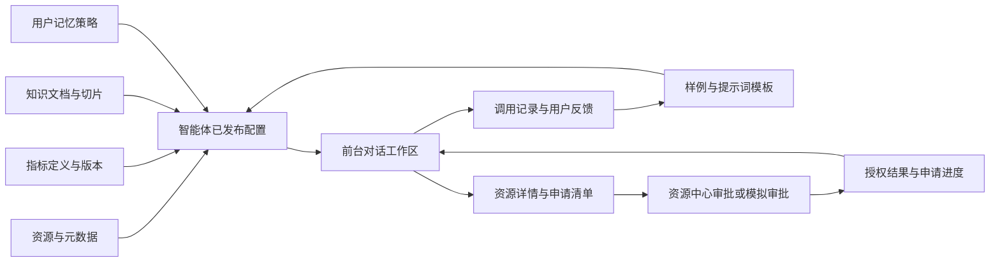

# 智能中心前后台需求整理

## 1. 建设定位与范围

建设面向自然资源部门的智能中心，包含前台业务工作台和后台管理平台，覆盖智能资源检索助手与五类 AI 配套工具，形成“知识配置—能力发布—业务使用—反馈优化”的闭环。

前台面向部门内部业务人员，提供找资源、查知识、使用智能体、申请资源以及查看个人使用记录的入口。这里的“前台”是内部业务工作台，不等同于面向公众的门户网站。

后台面向资源管理员、知识管理员、智能应用管理员及平台管理员，提供资源语义维护、知识生产、指标配置、语料维护、用户记忆治理和能力发布管理。

本次范围以当前需求文档中的 `5.4.1.1.5. 智能中心` 为准。本文的页面划分、角色、状态、演示优先级及验收条件属于原型设计建议；原文没有明确的能力会单独注明。当前阶段仅分析和整理需求。

### 1.1 前后台分工总表

| 原文模块 | 前台：业务使用 | 后台：管理配置 |
| --- | --- | --- |
| 智能体集成与编排 | 浏览智能体广场、打开并使用智能体 | 配置智能体、关联工具和知识、编排步骤、调试和发布 |
| 智能资源检索助手 | 自然语言检索、多轮追问、查看资源详情、批量申请 | 维护可检索资源、配置资源知识、维护检索提示词与样例 |
| 元数据标注功能 | 查看允许展示的字段、坐标系、更新频次等元数据 | 维护来源、模板、表级和字段级描述、枚举字典、资源关系 |
| 指标知识管理工具 | 理解指标含义、查看口径与示例分析结果 | 定义指标、配置计算模型、维护统计口径和版本 |
| 知识库管理工具 | 获取带来源的知识回答、查看授权文档 | 导入文档、切片、分类、版本维护、关联知识实体 |
| 语料管理工具 | 使用已配置能力、评价回答 | 管理问答样例、提示词模板、SQL 模板，处理反馈 |
| 用户记忆管理工具 | 使用个性化服务、续接会话、管理自己的偏好 | 管理画像规则、历史摘要机制、会话关联规则及运行状态 |
| 能力开放与持续进化 | 查看自己提交的反馈及处理结果 | 管理调用接口、调用日志、版本与反馈改进记录 |

### 1.2 三组容易混淆的概念

| 概念 | 区别 | 页面组织建议 |
| --- | --- | --- |
| 数字资源知识库 / 业务知识库 | 前者描述“有什么资源、在哪里、如何使用”；后者存放政策、规范、手册等业务知识 | 前者归入资源与元数据管理，后者独立为知识库管理 |
| 检索提示词工程 / 语料管理 | 检索提示词和问题样例是特定智能体使用的语料资产 | 统一放在语料管理维护，通过智能体配置关联，避免两套数据重复维护 |
| 用户画像 / 用户权限 | 画像影响术语、偏好和回答详略；权限决定能查看、使用哪些资源 | 画像与权限分别维护，个性化推荐始终受资源权限约束 |

## 2. 用户角色

以下为原型建议角色，可由同一演示账号切换体验，后续再对接实际组织角色。

| 角色 | 主要目标 | 主要入口 |
| --- | --- | --- |
| 业务用户 | 找资源、理解资源、申请使用、查知识 | 前台工作台、资源检索助手、我的申请 |
| 资源管理员 | 让资源可被准确发现、理解和关联 | 后台资源与元数据管理 |
| 知识管理员 | 维护业务知识、指标和训练样例 | 后台知识库、指标、语料管理 |
| 智能应用管理员 | 配置智能体能力、发布版本、分析反馈 | 后台智能体管理、调用与反馈 |
| 平台管理员 | 配置权限范围及公共运行参数 | 后台基础管理 |
| 资源审批人员 | 处理资源使用申请 | 资源中心审批入口；Demo 可提供模拟审批工作区 |

## 3. 前台业务工作台

### 3.1 导航结构

```text
智能中心
├── 工作台
├── 资源检索助手
│   ├── 对话与检索结果
│   ├── 资源详情
│   └── 申请清单与提交
├── 智能体广场
│   ├── 智能体详情
│   └── 智能体使用工作区
├── 资源目录
│   └── 资源详情（复用检索结果详情）
├── 我的申请
│   └── 申请详情与进度
└── 个人中心
    ├── 会话记录
    ├── 我的偏好与记忆
    └── 我的反馈
```

资源目录、我的申请和个人中心是为原型业务闭环补充的页面组织，不是原文独立列出的章节。

### 3.2 前台页面与功能

| 编号 | 页面 | 展示内容 | 核心操作 | 原型优先级 |
| --- | --- | --- | --- | --- |
| F01 | 工作台 | 对话入口、场景问题、常用智能体、最近会话、申请动态 | 点击场景开始检索、续接会话、进入申请详情 | P0 |
| F02 | 资源检索助手 | 历史会话、对话消息、已理解的区域/时间/资源类型、分类资源卡片 | 提问、追问、修改条件、停止响应、重新尝试、评价回答 | P0 |
| F03 | 资源详情 | 资源概述、元数据、更新信息、权限状态、关联资源、使用说明 | 查看字段或文档来源、加入申请清单、打开已授权资源 | P0 |
| F04 | 申请清单与提交 | 跨类型资源清单、用途、区域、期限、申请人信息 | 多选或移除资源、填写申请、提交并获取申请编号 | P0 |
| F05 | 我的申请 | 申请编号、资源数量、提交时间、办理状态 | 筛选、查看办理时间线、补充说明、撤回待审申请 | P0 |
| F06 | 智能体广场 | 智能体名称、能力描述、适用场景、使用示例 | 分类筛选、查看能力与使用范围、进入工作区 | P0 |
| F07 | 资源目录 | 库表、图层、工具、知识文档分类列表 | 按区域、类型、更新频次筛选，打开统一资源详情 | P1 |
| F08 | 个人中心 | 本人的会话、偏好、记忆摘要、反馈记录 | 续接会话、修正或清除本人记忆、关闭个性化、查看反馈进度 | P1 |

P0 表示优先完成业务演示主流程；P1 同属完整 Demo 范围，在主流程之后补齐。

### 3.3 资源检索助手详细设计

建议采用“左侧会话列表＋中间对话及结果＋右侧详情抽屉”的布局。没有打开详情时，对话与结果区占据主要空间。

一次查询需要呈现：

1. 用户原始问题。
2. 系统识别的区域、时间范围、资源类型等可修改条件。
3. 分类检索结果及命中理由，例如“名称同义词命中”“覆盖所选行政区”。
4. 资源名称、类型、提供单位、更新时间、更新频次和可用状态。
5. 查看详情、加入申请清单或打开已授权资源等操作。
6. 下一步建议，例如“仅看近一个月更新的数据”“同时推荐相关图层”。

示例问题：

- 找最近的地灾巡查记录表。
- 只看呼和浩特市最近一个月的数据。
- 推荐合适的耕地监测工具。
- 把相关图层和工具一起加入申请。

“最近”不能只依靠默认值静默解释；页面需要明确显示采用的时间范围。缺少必要条件时提供补充选择，追问时保留已经确定的条件。

检索资源与回答业务知识应采用不同结果组件：资源查询展示资源卡片；知识问答展示回答及引用；指标分析展示指标口径、结果表和图表。它们可以共用对话工作区。

### 3.4 按资源类型展示详情

| 资源类型 | 关键详情 | 使用入口 |
| --- | --- | --- |
| 数据库表 | 表名、业务解释、字段说明、覆盖区域、时间范围、更新频次 | 查看授权样例或申请使用 |
| 图层服务 | 图层类型、坐标系、覆盖范围、更新信息、关联数据源 | 图层预览或申请使用 |
| 工具服务 | 能力说明、适用场景、输入参数、输出结果、使用限制 | 打开工具示例或申请使用 |
| 知识文档 | 标题、发布单位、版本、生效信息、相关片段 | 查阅授权正文与引用定位 |

图层预览在 Demo 中可使用示例范围和示例属性；是否接入真实地图服务属于后续实现选择。

### 3.5 申请与权限表现

建议区分三种可见资源状态：已授权、可申请、申请中。不可发现的资源不进入用户结果集；是否允许查看元数据与是否允许访问实际数据分别判断。

申请建议采用“一张申请单＋多条资源明细”。原文要求跨类型资源的一揽子申请，但没有规定审批是否分流，因此 Demo 可先由一个模拟审批角色逐项处理，并显示部分通过的情况。

申请单建议状态：草稿、待审核、部分通过、已通过、已驳回、已撤回。资源授权另设有效、到期状态，避免将申请已通过等同于永久授权。

上述状态及撤回、补正交互是原型建议，正式审批节点、责任部门和时限需以资源中心规则为准。

## 4. 后台管理平台

### 4.1 导航结构

```text
智能中心管理平台
├── 管理总览
├── 智能体管理
│   ├── 智能体列表
│   ├── 能力配置与编排
│   └── 调试与版本发布
├── 资源与元数据管理
│   ├── 资源目录与来源
│   ├── 元数据模板
│   ├── 表级与字段级标注
│   ├── 枚举字典
│   └── 表关系与图层来源关系
├── 指标知识管理
│   ├── 指标分类与定义
│   ├── 计算模型与统计口径
│   └── 版本与试算
├── 知识库管理
│   ├── 知识库与文档
│   ├── 切片与标签
│   ├── 实体关系
│   └── 版本与检索测试
├── 语料管理
│   ├── 问答样例
│   ├── 提示词模板
│   ├── SQL 模板
│   └── 测试与版本
├── 用户记忆管理
│   ├── 画像规则
│   ├── 历史摘要
│   └── 会话状态
├── 调用与反馈
│   ├── 能力接口与调用记录
│   └── 用户反馈与改进记录
├── 资源申请对接
│   ├── 申请记录与同步状态
│   └── 模拟审批（Demo 配套）
└── 基础管理
    ├── 角色与访问范围
    └── 操作日志
```

五类工具均作为后台一级业务模块保留。子功能优先采用页签、详情页和编辑抽屉承载，避免把每个配置项都变成独立导航。

### 4.2 后台页面与功能

| 编号 | 模块 | 管理内容 | 核心交互 | 原型优先级 |
| --- | --- | --- | --- | --- |
| B01 | 管理总览 | 资源、智能体、知识文档、待标注任务、调用与反馈概况 | 点击统计进入对应列表，查看待处理事项 | P1 |
| B02 | 智能体管理 | 基本信息、场景、工具绑定、知识绑定、提示词、记忆策略、版本 | 新建、配置、调整步骤、调试、发布、停用 | P0 |
| B03 | 资源与元数据管理 | 四类资源、来源、模板、字段、字典、关联关系 | 筛选、新建或编辑、辅助标注、人工确认、发布 | P0 |
| B04 | 指标知识管理 | 指标定义、单位、口径、模型、数据映射、版本 | 配置、校验、示例试算、版本比较、发布 | P0 |
| B05 | 知识库管理 | 知识库、文档、切片、标签、实体关系、版本 | 导入示例文档、预览切片、修改标签、检索测试、发布 | P0 |
| B06 | 语料管理 | 问答对、提示词模板、SQL 模板、测试案例 | 编辑、参数校验、试运行、比较版本、关联智能体 | P0 |
| B07 | 用户记忆管理 | 画像规则、摘要记录、会话关联及启用状态 | 查看授权记录、修正、禁用、清除、测试个性化表现 | P0 |
| B08 | 调用与反馈 | 能力接口、调用记录、命中资源与版本、评价和问题单 | 过滤记录、定位来源、标记问题、转为待审样例 | P1 |
| B09 | 资源申请对接 | 申请单、资源明细、办理节点、同步结果 | 查看、模拟逐项审批、更新授权、演示失败重试 | P0 |
| B10 | 基础管理 | 角色、菜单可见范围、资源范围、操作日志 | 切换演示角色、调整访问范围、查看操作记录 | P1 |

### 4.3 元数据标注功能

对应原文 `5.4.1.1.5.2.1`，并承接 `5.4.1.1.5.1.1` 数字资源知识库建设。

| 子功能 | 需要维护的信息 | 原型表现 |
| --- | --- | --- |
| 来源标注 | 来源类型、来源名称、资源标识、提供单位 | 选择示例来源并关联资源 |
| 模板管理 | 模板名称、适用资源类型、字段定义 | 新建、编辑、复制、删除未使用模板 |
| 表级标注 | 专有名称、同义词、业务解释 | 表单维护，显示辅助建议与人工确认结果 |
| 字段级标注 | 字段名、字段同义词、AI 查询字段、显示字段、定位类型、单位、专题字段、统计/汇总标记、枚举、解释 | 字段表格逐行编辑和校验 |
| 枚举字典 | 类别编码、别名、字典项编码、名称与值 | 左侧字典分类，右侧字典项维护 |
| 关系维护 | 表间关联字段、图层与数据源关系 | 展示关系连线及关系明细，支持添加或移除关系 |

关键联动：在元数据中将“地灾巡查”增加为某张库表的同义词并发布后，前台使用该词检索可以命中这张表。

### 4.4 指标知识管理工具

对应原文 `5.4.1.1.5.2.2`。

指标详情建议包含：指标编码、名称、业务分类、定义、单位、计算表达式、关联资源与字段、时间维度、区域维度、统计口径、版本、发布状态。

需要体现以下操作：

1. 维护耕地保护、矿产开发、生态修复、地灾防治等指标分类。
2. 新建指标并填写含义、单位和统计口径。
3. 关联示例库表与字段，配置受控的计算表达式。
4. 选择区域和时间，在示例数据上试算并查看明细。
5. 比较新旧版本的定义与口径，发布后供指定智能体使用。

关键联动：前台查看示例指标分析时，展示实际采用的单位、统计周期、口径和版本。只有时间与口径可比时才展示趋势比较。

指标问数展示是为了呈现后台指标配置价值而提出的 Demo 场景；原文未给出完整问数产品需求，不据此扩展成完整 BI 平台。

### 4.5 知识库管理工具

对应原文 `5.4.1.1.5.2.3`。

管理内容包括政策法规、技术规范、业务手册、案例经验和数据字典。页面采用“知识库列表—文档列表—文档详情”的结构，文档详情提供原文、切片、标签、实体关系和版本页签。

建议展示导入、处理中、可用、失败四类处理状态，另设草稿、已发布、已停用等发布状态。导入完成不自动等同于前台可检索。

核心操作：导入示例文档、预览并编辑切片、维护分类标签、查看实体关系、执行检索测试、发布文档版本。

关键联动：后台发布知识文档后，前台相关回答能够打开引用片段，并定位到具体文档版本。删除或停用文档后，新查询不再引用该文档。

### 4.6 语料管理工具

对应原文 `5.4.1.1.5.2.4`，统一承接 `5.4.1.1.5.1.2` 提示词工程。

| 语料类型 | 字段建议 | 典型操作 |
| --- | --- | --- |
| 问答样例 | 问题、标准答案或预期结果、场景、关联资源、标签、版本 | 新建、编辑、加入测试集、查看测试结果 |
| 提示词模板 | 名称、适用智能体、指令正文、变量、输出格式、版本 | 编辑、填写变量、预览、比较版本、发布 |
| SQL 模板 | 名称、适用指标或场景、查询模板、参数定义、关联资源、结果列 | 参数校验、查询预览、示例结果查看、版本维护 |

关键联动：前台回答反馈转入后台待处理记录，管理员修正后形成待审样例；经人工确认再加入正式样例集。反馈不直接覆盖已发布模板。

Demo 的 SQL 模板试运行使用预置参数与示例结果，页面明确标识“示例试运行”；真实数据库执行留作后续接入。

### 4.7 用户记忆管理工具

对应原文 `5.4.1.1.5.2.5`。

| 子模块 | 后台管理 | 前台体现 |
| --- | --- | --- |
| 用户画像 | 部门、常用领域、技能等级、回答偏好及标签来源 | 默认推荐常用领域，调整解释深度 |
| 历史摘要 | 摘要内容、来源会话、更新时间、适用用户、有效状态 | 新会话可以延续已确认的长期偏好 |
| 会话状态 | 当前区域、时间、筛选条件、任务进度、关联会话 | 多轮追问沿用上下文，显示可修改条件 |

管理策略与用户个人记忆需要分开：前台用户可查看并修正自己的偏好；后台普通管理员不默认拥有所有用户完整对话的查看权限。演示可使用明确授权的虚构用户记录。

关键联动：将演示用户的常用区域改为呼和浩特市后，新会话显示该默认区域；当前会话明确指定其他区域时，以当前会话为准。关闭个性化后，新会话不再自动采用个人偏好。

### 4.8 智能体配置、能力开放与反馈

智能体配置集中关联资源范围、知识库、指标、提示词模板、工具和记忆策略。原型建议提供有序步骤配置，例如“识别条件—检索资源—展示结果—发起申请”，以及一次可查看的调试记录。

首轮 Demo 用步骤列表和参数面板表达编排关系；复杂分支、循环和多智能体运行调度属于后续深化能力。

调用记录至少包含调用时间、智能体版本、结果状态、资源或引用标识、耗时与反馈。前台已发布智能体与后台配置版本需要一一对应，草稿修改不立即影响前台。

能力接口页可展示接口名称、用途、输入输出样例和关联智能体。尚未接入的接口应明确显示接入状态，不能以静态“调用成功”替代实际状态。

## 5. 两端联动与数据关系

### 5.1 核心数据关系



### 5.2 数据对象建议

| 对象 | 核心标识及关联 | 一致性要求 |
| --- | --- | --- |
| 资源 | resourceId、type、region、source、version、accessPolicy | 前台卡片、详情、申请使用同一资源标识 |
| 元数据 | resourceId、fields、aliases、dictionaryIds、relations | 同义词与字段标注发布后影响新检索 |
| 指标 | indicatorId、resourceIds、formula、unit、caliber、version | 展示结果保留计算口径和版本 |
| 知识文档与切片 | documentId、version、chunkId、sourceLocation | 引用可定位到对应文档版本和片段 |
| 语料 | sampleId/templateId、scene、variables、version | 智能体绑定明确的已发布版本 |
| 智能体 | agentId、bindings、steps、publishedVersion | 广场展示与后台发布状态一致 |
| 会话与记忆 | userId、sessionId、messages、summary、preferences | 按用户隔离，当前明确指令覆盖默认偏好 |
| 申请单与明细 | applicationId、applicantId、resourceIds、itemDecisions | 支持逐项审批及部分通过 |
| 授权 | userId、resourceId、validUntil、status | 申请结果变更后同步资源可用状态 |
| 反馈 | feedbackId、sessionId、messageId、status | 能追溯被评价回答及处理过程 |

### 5.3 推荐演示脚本

| 场景 | 后台操作 | 前台验证结果 |
| --- | --- | --- |
| 资源可被理解 | 为库表增加“地灾巡查”同义词并发布 | 用该词检索命中资源，详情字段与后台一致 |
| 跨类型资源申请 | 模拟通过库表申请、驳回工具申请 | 一张申请单显示部分通过，只有获批资源可使用 |
| 知识回答可追溯 | 发布一份耕地保护示例文档 | 提问后显示引用，可打开对应片段和版本 |
| 指标口径可解释 | 维护一个指标的单位和口径，完成示例试算 | 指标回答显示同样的单位、口径与结果 |
| 反馈推动改进 | 将错误回答反馈整理为待审样例并确认 | 反馈状态更新，后续预设场景使用更新后的样例 |
| 记忆影响体验 | 修改演示用户偏好与摘要 | 新会话采用偏好，用户明确修改条件后以新条件为准 |

## 6. Demo 范围与验收建议

### 6.1 实现层次

完整 Demo 覆盖前台助手和后台五类工具，每类工具至少具备一条可操作、可保存、可在前台验证的流程。

| 层次 | 本轮原型建议 |
| --- | --- |
| 可操作功能 | 导航、筛选、详情、表单、保存、版本切换、申请流转、角色切换 |
| 可联动数据 | 元数据与资源卡片、文档与引用、指标与口径、申请与授权、记忆与默认条件 |
| AI 效果演示 | 预设场景和受控规则驱动，提供生成中、无结果、失败重试等状态 |
| 后续真实接入 | 大模型、向量检索、真实 SQL 执行、真实资源中心审批、生产身份认证 |

演示数据、模拟审批及示例试运行应在相应场景明确标识。任意问题无法处理时给出可继续操作的提示，不返回与问题无关的固定成功答案。

### 6.2 验收清单

- 前台所有主导航均能打开，资源详情支持从检索和目录两个入口进入。
- 后台五类工具均有列表、详情或配置界面，主要操作后能看到数据变化。
- 同一资源的名称、字段、版本和权限状态在前后台一致。
- 批量申请能选择不同类型资源，重复提交不会生成重复申请。
- 审批结果能够改变前台申请进度和对应资源授权状态。
- 知识回答引用可以打开，且与后台发布版本对应。
- 未填写必填项、模板参数错误、无检索结果、无使用权限、加载失败都有明确反馈。
- 停用资源或智能体后，新访问不能继续正常使用；历史记录保留可追溯信息。
- 用户记忆按身份隔离，切换用户后不沿用另一用户的私人会话和摘要。
- 页面刷新保留已保存的演示修改；提供单独的“重置演示数据”入口，重置前确认。
- 主要面向桌面浏览器，优先检查 1440px 与 1920px 宽度；窄屏保证导航和表单基本可用。

## 7. 当前项目调研结论

本次调研依据当前需求文件及工作区已有代码，属于需求与实现基础分析，未进行外部竞品实测，也未重新运行旧项目验证其运行状态。

| 调研对象 | 当前发现 | 对本次 Demo 的影响 |
| --- | --- | --- |
| 当前需求文件 | 仅保留智能中心章节，覆盖检索助手与五类工具 | 按完整智能中心组织前后台 |
| 项目目录 | 旧多端工程已移至 `bak/`，根 README 仍引用原路径 | 新 Demo 启动说明需要使用实际目录，不能照搬旧命令 |
| 旧后台 | 原生 JavaScript、通用表格与表单、角色入口、审核时间线 | 可参考基础交互；五类工具需要专门的数据和页面结构 |
| 旧业务检索 | 对已有内容、目录、成果执行关键词包含匹配 | 不具备本次要求的语义检索、多轮会话和统一资源申请能力 |
| 旧共享服务 | Python 标准库 HTTP 服务、SQLite、修订号、错误响应、状态流转 | 可参考持久化和状态校验方式 |
| 旧资源目录 | 基础名称、分类、区域、来源、版本、描述 | 缺少完整字段标注、字典关系、指标、切片和语料模型 |
| 旧审批 | 内容、成果、核查、反馈等固定业务流转 | 公众反馈中的“数据申请”分类不等同于跨资源审批授权模型 |
| 旧工作流配置 | 保存节点字符串；执行逻辑定义在服务端固定动作表 | 不能直接作为智能体编排引擎使用 |
| 旧视觉基础 | 浅色背景、蓝色主色、侧栏、表格、抽屉或弹窗 | 可延续内部业务系统风格，为前台对话单独设计布局 |

建议后续创建独立智能中心 Demo 工程，保留旧工程作为参考。前后台共用领域数据和状态更新逻辑，避免各自维护一套无法联动的演示记录。具体框架及存储方案在页面方案确定后再落定。

## 8. 后续细化事项

以下问题不影响当前前后台拆分，可在原型细化时逐项决定：

1. 首页优先进入资源助手，还是先展示完整工作台。
2. 智能体广场中除资源检索助手外，需要重点演示哪些已有智能体。
3. 资源中心审批采用单节点演示，还是体现跨部门分流。
4. 图层详情采用轻量范围预览，还是接入现有一张图地图组件。
5. Demo 使用单浏览器本地持久化，还是提供前后台跨浏览器共享服务。
6. 是否有既定页面风格、品牌规范或需要参考的现有系统。

下一阶段建议先明确前后台页面布局与六条演示脚本，再进入交互原型实现。
