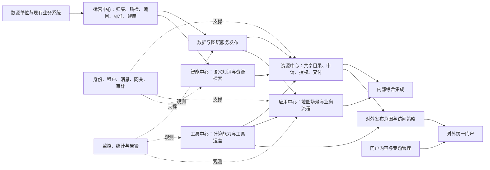

# 一张图全局需求分析与后台设计基线

> 版本：V1.0｜整理日期：2026-09-16｜状态：需求分析稿，供后台功能设计与原型设计使用。

> 实施跟踪：当前原型已完成部分管理设计调整，见[后台管理首轮调整说明](../../docs/后台管理首轮调整说明.md)。本文仍为全局需求基线，功能编号不代表独立菜单或已实现范围。
> 输入范围：`img/all` 中现有的 11 份 Markdown。本文按这些整理稿分析，未重新核验扫描件，也未检查当前系统的代码、页面和接口实现。
> 使用约定：**【原文】**表示输入文档明确描述的能力；**【建议】**表示为形成完整后台和交互流程提出的设计方案；**【待定】**表示输入不足或存在冲突。未特别标明的菜单、页面组合、角色拆分、字段方案、状态机、优先级及验收用例均为设计建议，不代表已批准的建设范围。

本文将11份资料整理为10个后台工作域、54个功能与页面组，提供8条跨模块流程、12个原型演示场景、21项资料差异和15项待确认问题，并建立290条来源记录索引。建议先阅读第1、3、5节掌握全局，再用第6、7、10节展开后台和原型设计；核对原文时查第15、16节。

## 目录

1. [全局判断与设计范围](#s1)
2. [资料来源与合并规则](#s2)
3. [产品边界与统一术语](#s3)
4. [用户角色与权限范围](#s4)
5. [全局能力关系与后台菜单](#s5)
6. [后台功能与页面设计清单](#s6)
7. [跨模块业务流程](#s7)
8. [核心对象与字段基线](#s8)
9. [共用能力与状态规则](#s9)
10. [原型页面与交互规范](#s10)
11. [外部系统对接范围](#s11)
12. [非功能要求与验收](#s12)
13. [资料差异与待确认问题](#s13)
14. [设计顺序与交付要求](#s14)
15. [正文补充能力追踪](#s15)
16. [主清单条目与设计入口索引](#s16)

<a id="s1"></a>
## 1. 全局判断与设计范围

### 1.1 可以据此建立怎样的后台

现有资料描述的是覆盖数据治理、资源共享、工具开放、应用构建、智能服务、内外门户及平台运维的一套自然资源服务体系。后台应围绕数据与能力的生产、发布、授权、使用和运行维护组织管理功能，同时支撑内部工作门户和互联网公共服务门户。

后续设计需要首先落实以下关系：

1. **运营中心生产和治理数据，资源中心组织共享和使用。** 库表、图层和接口的采集、编目、质量与发布由治理侧维护，前台资源目录引用其有效成果。
2. **工具、应用和智能能力具有各自的配置对象。** 可复用分类、审核、授权和日志框架，但工具接口、地图模板、业务流程、智能知识配置要分别设计。
3. **综合集成是内部统一入口。** 它汇集地图成果、资源和工作任务；其后台管理重点是导航、展示配置和系统对接。
4. **“统一门户（服务端）”是面向公众和企业的对外门户。** 其中第2.7项才是该门户的后台管理要求，不能把整章当作技术服务端接口需求。
5. **后台共用能力要明确归属。** 身份、租户、资源目录、共享审核、消息投递、统计和审计均有跨模块使用场景。
6. **原型必须演示结果落地。** 审核通过后应能看到授权或交付结果；发布后能看到对应前台展示；告警处理后能看到处理记录。只有管理列表不足以表达需求。

### 1.2 本文的设计边界

| 范围 | 本文处理 | 后续设计影响 |
| --- | --- | --- |
| 综合集成、五大中心、对外统一门户 | 全部纳入全局分析 | 形成统一后台功能地图和角色视图 |
| 原文明确的门户后台八类能力 | 纳入共用后台，不遗漏其对外服务特性 | 保留公众用户、API密钥、内容、安全配置等功能 |
| 自然资源“大管家”等8类场景主题 | 纳入目录、集成和应用配置 | 资料不足以设计每个专业业务系统的完整业务后台 |
| 现有系统、时空地图中台、AI平台 | 标识接入依赖 | 先确定新建、复用和集成边界，再决定配置器深度 |
| 内外网部署与数据交换 | 标识为架构决策 | 统一信息架构不意味着共用网络、数据库或登录会话 |
| 原表测算数值 | 保留在源文档，不用于本文排期与估算 | 表头及单位缺失，不能推定工期、预算或人月 |
| 当前项目实现情况 | 本次未核查 | 本文是需求基线，不能据此宣称某功能已完成或缺失 |

<a id="s2"></a>
## 2. 资料来源与合并规则

### 2.1 来源登记

后文使用“来源ID＋原文编号”追踪需求。名称相同不代表不同文件中的编号完全一致。

| 来源ID | 文件 | 内容性质与覆盖 | 本文用途 |
| --- | --- | --- | --- |
| S01 | [综合集成功能清单_附表2.1.md](综合集成功能清单_附表2.1.md) | 附表1.1；包括现有系统集成、国家节点对接、三级贯通和横向联动 | 综合集成功能骨架及对接清单 |
| S02 | [资源中心功能清单_附表2.1.md](资源中心功能清单_附表2.1.md) | 附表1.2；检索、申请车、我的资源、审核和分发 | 资源共享主清单 |
| S03 | [工具中心功能清单_附表2.1.md](工具中心功能清单_附表2.1.md) | 附表1.3；空间计算、检索、使用申请、上下架和权限 | 工具能力主清单 |
| S04 | [应用中心功能清单_正文识别.md](应用中心功能清单_正文识别.md) | 文件名含“正文”，实际来源为附表1.4；自述64个末级功能项 | 应用构建、流程、身份、网关、消息主清单 |
| S05 | [智能中心功能清单_正文识别.md](智能中心功能清单_正文识别.md) | 实际来源为附表1.5；自述18个末级功能项 | 检索助手与AI配套工具主清单 |
| S06 | [运营中心功能清单_附表2.1.md](运营中心功能清单_附表2.1.md) | 附表1.6；归集、质检、编目、标准、建库、发布、监控 | 数据治理和运维主清单 |
| S07 | [统一门户服务端_功能清单_附表识别.md](统一门户服务端_功能清单_附表识别.md) | 附表第2项；7模块、48项功能 | 对外门户和配套后台主清单 |
| S08 | [运营中心_正文.md](运营中心_正文.md) | 跨综合集成、资源、工具、运营等章节的正文整理；末尾标注截断 | 补充地图操作、空间分析、使用规则和监控细节 |
| S09 | [应用中心_正文.md](应用中心_正文.md) | 正文5.4.1.1.4；用户管理层级与附表不同 | 补充可视化配置、消息可靠投递和角色首页说明 |
| S10 | [智能体中心.md](智能体中心.md) | 正文5.4.1.1.5；内容称“智能中心” | 补充既有AI能力集成、指标口径、编排和反馈机制 |
| S11 | [门户页面_正文识别.md](门户页面_正文识别.md) | 正文5.4.1.2；对外服务窗口定位 | 确定服务对象、互联网区及栏目定位 |

### 2.2 合并原则

**【建议】**以 S01-S07 的编号清单建立追踪骨架，用 S08-S11 补充行为和业务约束。这个选择仅便于设计追踪，不认定附表与正文之间的正式优先级。

- 同一能力多次出现，建立一个管理对象及其多个入口，不重复建立数据台账。
- 正文有明确细节而清单未展开时，保留为“正文补充”，不能因未单列测算项而删除。
- 编号错位按功能名称、上下文及对象归类；保留源编号，另给后台页面稳定ID。
- 同名但不同对象的能力分别建模，如消息订阅与数据订阅、业务知识库与AI知识库。
- 不以标题行数或不同文件末级项数直接相加计算去重需求总量。
- 资料冲突集中登记于第13节，设计时采用可替换配置，避免把不确定解释固化成业务规则。

<a id="s3"></a>
## 3. 产品边界与统一术语

### 3.1 各端分工

| 产品区域 | 主要用户与目标 | 前台行为 | 后台职责与边界 |
| --- | --- | --- | --- |
| 内部综合集成 | 管理层、业务人员；看成果、找资源、办任务 | 地图浏览、分析、综合搜索、工作台、系统跳转 | 维护展示配置和集成关系；引用资源、应用和任务的权威来源 |
| 资源中心 | 内部业务人员、数据使用者、开发者 | 目录检索、详情预览、申请车、申请记录、下载/订阅/调用 | 管理共享目录视图、使用审核、授权和交付；引用治理侧资产 |
| 工具中心 | 工具提供者、业务人员、开发者 | 分类检索、在线测试、申请、调用 | 维护工具说明、接口参数、版本、上下架及权限 |
| 应用中心 | 场景建设者、流程配置人员、应用运营者 | 场景访问、地图构建、业务办理 | 地图模板与控件、流程与表单、应用上架；身份网关消息由共用平台支撑 |
| 智能中心 | 业务用户、AI知识管理员 | 对话检索、理解资源、发起使用申请 | 管理资源知识、语义标注、指标、语料和用户记忆；对接既有智能体平台 |
| 运营中心 | 数源单位、数据管理员、运维人员 | 归集填报、自助质检、问题处理 | 数据从归集到发布的治理闭环，以及运行监测 |
| 对外统一门户 | 公众、企业、科研院所、开发者 | 数据与能力申请、办事查询、资讯下载、专题浏览 | 对外发布配置、公众账户、密钥、内容、咨询和专题；调用受控服务 |

### 3.2 必须区分的对象

| 术语 | 建议定义 | 不宜混用的概念 |
| --- | --- | --- |
| 数据资产 | 已登记的库表、视图、文件、栅格或其他数据对象及其元数据 | 门户展示卡片、用户授权 |
| 图层服务 | 对一个或多个空间图层提供访问能力的服务 | 源空间表、地图展示目录 |
| 数据接口 | 面向数据查询或分发的服务接口 | 执行分析和计算的工具接口 |
| 工具 | 可调用的计算/分析/操作能力，含接口和说明 | 应用编辑器中的界面控件 |
| 应用/场景 | 已构建或已接入、可供用户访问的业务入口 | 应用模板、外部系统接入配置 |
| 应用模板 | 用于生成地图应用的配置资产 | 已发布应用实例；两者生命周期应分离 |
| 技术发布 | 生成或注册一个可运行的服务端点 | 对公众上架、给具体用户授权 |
| 上架 | 在指定门户、租户或用户范围展示可申请的资源/能力 | 所有用户都可直接下载和调用 |
| 共享授权 | 特定用户/应用对特定资源、操作、期限和范围的使用许可 | 页面菜单权限、登录认证 |
| 归集工单 | 数源单位提交或按任务上报数据的业务记录 | 申请使用他人数据的共享申请 |
| 治理工单 | 对质检问题或线下问题的处理与复核记录 | 运维告警、行政审批报件 |
| 数据订阅 | 持续接收获批数据的共享方式 | 消息总线的事件订阅 |
| AI元数据 | 基于技术元数据增加的业务语义、同义词、指标解释 | 原始字段结构及其权威定义 |
| 审核状态/交付状态 | 前者描述审批结果，后者描述授权或数据是否成功交付 | 单个“已完成”标签 |

<a id="s4"></a>
## 4. 用户角色与权限范围

### 4.1 角色设计建议

原文明确区划管理员、单位管理员、不同层级工作人员、自然人/法人、普通用户/企业/管理员等角色。下表把管理职责进一步拆开，具体岗位是否独立配置待确定。

| 角色 | 主要职责 | 可管理范围 | 主要原型入口 |
| --- | --- | --- | --- |
| 平台管理人员 | 平台配置、租户和共用能力配置 | 按平台管理授权；不默认获得所有业务数据读取权 | SYS01-SYS05、X01-X03 |
| 区划管理员 | 自治区/盟市/旗县组织与权限分配 | 本区划及上级明确授予的范围 | SYS01、SYS02、W01 |
| 单位管理员 | 本单位用户和资源责任关系维护 | 所属单位、所属租户 | SYS01、D07、R01 |
| 数源单位填报人员 | 上报数据、反馈治理问题 | 本单位任务及被指派工单 | D01-D03、D06 |
| 数据治理人员 | 质检、编目、标准、建库、发布 | 授权的数据源和资产 | D04-D12 |
| 共享审核人员 | 审核数据/工具使用及交付条件 | 分配的申请类型和数源范围 | R02-R05 |
| 工具运营人员 | 注册工具、维护版本、处理上架 | 自有或授权工具 | T01、T02 |
| 应用建设/流程配置人员 | 地图模板、控件、业务流程和应用维护 | 所属应用与业务体系 | A01-A08 |
| AI知识与运营人员 | 标注、指标、知识库、语料及智能能力配置 | 授权知识域和AI资产；用户记忆单独授权 | I01-I07 |
| 门户内容运营人员 | 首页、资讯、专题、办事指南和咨询维护 | 指定门户及栏目 | P01-P06 |
| 运维人员 | 监测、告警、网关和故障处置 | 被授权环境和服务 | O01-O03、SYS04-SYS05 |
| 审计人员 | 查询日志、检查授权与变更链 | 审计授权范围，原则上只读 | O04 |
| 内部业务用户 | 发现、申请和使用资源，办理业务 | 自己及所属组织获授权的资源 | 内部前台、申请车、个人中心 |
| 公众/企业/开发者 | 对外服务申请、密钥使用、查询办事 | 对外可见资源及个人/企业获批授权 | 对外门户、个人中心 |

### 4.2 权限至少包含六个维度

**【建议】**有效权限由“当前身份与租户、角色、业务操作、资源对象、数据范围、有效期”共同约束。地域上下级关系只表示可管理层级，不能自动推导对所有下级业务数据的读取权。

- 功能权限：可进入的菜单、可操作的按钮、可调用的接口。
- 管理范围：租户、区划、部门、数源系统与资源归属。
- 数据范围：库表、字段、行政区、空间范围，以及可提供的预览内容。
- 使用方式：下载、订阅、定时推送、图层访问、工具调用、离线获取、数据库访问。
- 时间与调用约束：有效期、启停状态、IP范围；调用配额是否需要纳入细化设计待定。
- 可见性与使用权分离：能检索到资源不等于已获得内容访问权；对外可见清单要有单独发布范围。

角色切换和租户切换都要重新计算列表、统计、待办与可用操作。AI检索结果、地图预览、下载任务和API调用同样受约束。

<a id="s5"></a>
## 5. 全局能力关系与后台菜单

### 5.1 能力依赖图



箭头表示业务依赖，不代表网络直连。对外服务的发布与访问路径需要结合政务云互联网区及实际交换机制确认。

### 5.2 建议后台信息架构

使用一个逻辑管理框架，按角色展示以下工作域；是否部署为多个管理入口另行确定。以下菜单把原“运营中心”拆为数据治理与运行维护两个工作域，并把应用中心中的身份等能力提取到系统管理，原文归属仍保留于来源索引。

| 一级工作域 | 二级管理内容 | 设计入口ID |
| --- | --- | --- |
| 工作台 | 角色总览、我的待办和通知 | W01-W02 |
| 数据资产与治理 | 归集、自助上报、登记入库、质检模型、质检任务、治理工单、数源、元数据、目录标签、标准、建库、服务发布 | D01-D12 |
| 资源共享与授权 | 共享资源、使用审核、授权交付、API密钥、数据分发 | R01-R05 |
| 工具服务 | 工具注册与版本、工具调用与权限配置 | T01-T02 |
| 应用与流程 | 地图模板、地图编辑、控件、业务模型、流程定义、表单、运行台账、业务配置资源 | A01-A08 |
| 智能中心 | 既有智能能力接入、检索知识、语义标注、指标知识、文档知识、语料模板、用户记忆与反馈 | I01-I07 |
| 门户与内容 | 内部门户、对外首页、资讯下载、专题、办事入口与指南、咨询及公众意见 | P01-P06 |
| 集成管理 | 业务系统接入、任务与消息、国家及三级节点对接 | X01-X03 |
| 运维与分析 | 运行监控、告警处置、使用统计、日志审计 | O01-O04 |
| 系统管理 | 租户组织用户、角色权限、身份认证、网关、安全与备份 | SYS01-SYS05 |

来源文档ID采用S01-S11，系统管理页面组采用SYS01-SYS05，两者独立。

这些ID表示功能和页面组，不等于最终路由数。一个页面组可包括列表、详情、编辑器和执行结果，也可复用其他页面组的抽屉。

### 5.3 重复功能的唯一管理归属

| 重复能力 | 建议唯一管理位置 | 其他模块的使用方式 |
| --- | --- | --- |
| 组织、用户、角色、单点登录 | SYS01-SYS03 | 所有中心读取统一身份和授权；对外账户保留其注册审核与认证规则 |
| 数据技术元信息 | D07-D08 | 资源详情、地图配置和AI标注引用；AI只维护语义扩展 |
| 分类目录和标签 | D09维护共享目录，业务域维护自己的专属分类 | 主题树引用目录；部门树和地区树按归属自动生成 |
| 使用申请审核 | R02，按申请类型和来源门户分派 | 工具中心、AI助手、对外门户引用同一类审核能力，流程策略可不同 |
| 工具/应用上架审核 | T01、A01及应用登记详情中的上架处理 | 可汇入W02待办；与使用申请区别建模 |
| 消息投递 | X02 | 门户公告、审批结果、上新和告警配置事件及接收对象 |
| 监控与统计 | O01-O03 | 各中心与综合集成展示带预置筛选条件的视图 |
| 操作、登录与调用日志 | O04 | 详情页展示当前对象日志，审计页做全局授权范围内检索 |
| 内容文档与AI知识 | P03维护面向阅读的发布内容，I05维护知识处理结果 | AI按版本引用原文，业务流程引用有效政策；三者不直接共用状态 |

<a id="s6"></a>
## 6. 后台功能与页面设计清单

本节“原文能力”列为来源要求摘要；“后台页面与关键操作”列是其建议落位。等级为**原型设计顺序**：P0优先打通主链路，P1补齐其余明确功能，P2处理深化或依赖较多的能力；不表示删除或推迟已承诺的建设需求。

### 6.1 工作台

| ID | 原文能力与来源 | 后台页面与关键操作 | 顺序 |
| --- | --- | --- | --- |
| W01 | 资源、工具、应用、办件和运行统计；S01 1.1.1-1.1.2，S04 1.4.2.1，S06 1.6.7，S07 2.7.8 | 按角色显示资源规模、归集进度、审核待办、异常服务和最近操作；区划、部门、时间筛选可穿透至明细 | P0 |
| W02 | 待办、个人应用/工具、消息；S01 1.1.3，S04 1.4.2.1.2 | 待办、已办、预警、通知分别呈现；显示来源系统、任务类型、处理人和到期时间，跳转实际业务对象 | P0 |

### 6.2 数据资产与治理

| ID | 原文能力与来源 | 后台页面与关键操作 | 顺序 |
| --- | --- | --- | --- |
| D01 | 接收/上报概览、归集任务及待办/已办/办结；S06 1.6.1.1-1.6.1.2 | 概览与工单列表；创建任务、填报、查看审核及归集结果；支持实时归集、在线提交、定时抽取、离线提交四类入口 | P0 |
| D02 | 我的自助归集、待办、办结；S06 1.6.1.3 | 自助上报表单、附件区、登记详情与审核记录；按在线/离线方式显示字段 | P1 |
| D03 | 登记任务、退回/转审/通过、条件撤回、文件入库与查询；S06 1.6.1.4 | 登记列表和入库向导；gdb/Excel/mdb文件、增量/全量/新增方式、目标库表、字段映射、执行进度与结果；审核和技术执行分开显示 | P0 |
| D04 | 第三方、自定义、SQL质检模型；S06 1.6.2.1 | 模型列表、规则/模板配置、模型详情；选择适用数据对象，展示验证结果 | P0 |
| D05 | 质检任务、频率、开始时间、立即执行、结果和数据报告、自助质检；S06 1.6.2.2、1.6.2.5 | 任务列表、执行历史、错误明细和报告；按区域选取未治理记录生成治理工单 | P0 |
| D06 | 问题工单、用户自助问题、线下治理及反馈复核；S06 1.6.2.3-1.6.2.4 | 以来源类型区分问题，保留不同任务视图；派单、上传处理证据、审核反馈、符合条件时撤回，形成处置时间线 | P0 |
| D07 | 应用采集、归属关联、数据库/服务/字典采集；S06 1.6.3.1 | 数源系统与连接登记、站点批量/单服务注册；支持Oracle、PG、空间库及ArcGISService、GeoServer、Geoscene来源；显示异步采集进度 | P0 |
| D08 | 库表字段元数据、图层数据源关系、主从表关联、链路分析、元数据接口；S06 1.6.3.1、1.6.3.3.3、1.6.3.5 | 资产详情工作区；基本信息、字段、关联表/图层、关系图、技术服务引用及元数据接口入口 | P0 |
| D09 | 分类目录、模式/资源/服务/接口编目及标签；S06 1.6.3.2-1.6.3.4 | 目录树＋资产列表；挂接、移除、系统/自定义标签、目录同步与清理；同步或批量清理前展示影响范围 | P0 |
| D10 | 标准定义、命名、变更日志、字典、文件、元模型；S06 1.6.4 | 标准集与目录、字典项、模型属性、文件分组；标准发布/下线、历史变更、字典Excel导入导出、文件预览下载 | P1 |
| D11 | 数据分域、创建数据集/属性表/图形表、关联标准自动建表；S06 1.6.5 | 数仓层级/分域树、库表详情、建表向导及分组；引用D10标准 | P1 |
| D12 | 数据源模型、接口发布、组件接口定制、MapService/WMS发布；S06 1.6.6，S07 2.2.7 | SQL/关系配置、接口参数与测试向导；空间数据选择、MXD或样式配置、服务发布记录；WMTS/WFS能力适配单独标识 | P0 |

### 6.3 资源共享与授权

| ID | 原文能力与来源 | 后台页面与关键操作 | 顺序 |
| --- | --- | --- | --- |
| R01 | 库表/图层目录、筛选、详情及对外数据发布管理；S02 1.2.1-1.2.2，S07 2.2.1-2.2.3、2.7.1 | 共享资源管理，引用治理资产；配置展示内容、共享方式与服务范围，预览内部/对外详情；前台保留三类目录、热度排序和申请入口 | P0 |
| R02 | 申请车、七类使用审核，对外用途/期限/范围申请；S02 1.2.3、1.2.5.1，S03 1.3.3，S05 1.5.1.4，S07 2.2.4-2.2.5 | 统一使用申请列表和审核详情；逐资源显示申请与批准范围、处理记录、通过/退回/拒绝；跨单位拆单及部分通过规则待定 | P0 |
| R03 | 我的资源、有效期/IP/禁用、订阅暂停、离线领取、库表字段指定；S02 1.2.4-1.2.5.1，S07 2.2.6 | 授权台账与交付详情；数据包、推送注册、服务URL、领取通知、受控数据库访问分别呈现；服务不可用或授权到期时给出原因 | P0 |
| R04 | API密钥申请、审核、启用/停用、调用统计；S07 2.2.8、2.3.4、2.7.2 | 密钥申请与凭证台账，绑定用户/应用、资源授权与状态；凭证展示脱敏；重置/轮换为待确认的生命周期补充 | P0 |
| R05 | 数据包/数据表分发、进度、行政区/空间过滤；S02 1.2.5.2；对外裁剪下载S07 2.2.6 | 分发和下载任务列表，选择目标及范围，查看生成/传输进度、失败原因和接收结果 | P1 |

申请车、我的资源和API申请的用户操作保留在使用端。后台原型需要配套最小用户页面验证“申请→审核→交付”，无需把所有前台卡片复制成后台菜单。

### 6.4 工具服务

| ID | 原文能力与来源 | 后台页面与关键操作 | 顺序 |
| --- | --- | --- | --- |
| T01 | 工具检索、上架注册/审核/下架、权限及版本；S03 1.3.2-1.3.5，S07 2.3.5、2.7.2，S08工具中心概述 | 工具台账，基本信息、分类、提供方、版本、说明、截图、申请方式、发布范围；单独处理上架审核和使用申请 | P0 |
| T02 | 七类空间组件、接口参数/示例/测试、公众分析工具及教程；S03 1.3.1.1-1.3.1.7、1.3.2.4，S07 2.3.1-2.3.6 | 接口配置与在线测试面板；参数、坐标系、输入范围、返回结果和权限；基础分析、合规审查保留各自结果结构 | P0 |

【原文】内部组件包括叠加、坐标转换、空间检查、入库、面积核算、编辑、查询；对外能力还包括缓冲区、项目选址及合规性审查、国家/自治区能力市场。**【建议】**在后台维护能力类型及允许操作，对外能力清单不自动包含空间入库和编辑等写入类工具。

### 6.5 应用与流程

| ID | 原文能力与来源 | 后台页面与关键操作 | 顺序 |
| --- | --- | --- | --- |
| A01 | 模板新建/复制/编辑/删除/预览，应用注册/审核/下架；S04 1.4.1.2、1.4.7 | 分开管理模板资产与应用实例，提供关联入口；应用类型可区分配置生成与外部接入，上架前展示依赖检查 | P0 |
| A02 | 地图框架、底图、图层、控件和通用配置；S04 1.4.1.1、1.4.1.3，S09对应正文 | 地图编辑器：左侧资源与树、中央地图、右侧属性；引擎/坐标系、默认范围、相机、主题、高亮绘制样式、服务地址配置与预览 | P0 |
| A03 | 微件分组、上传、信息维护、正式发布、下架后重新启用；S04 1.4.1.4 | 控件库、包上传、编码/图标/版本/地图状态/终端编辑；存在关联的分组不可删除 | P1 |
| A04 | 业务模型、业务体系；S04 1.4.2.3-1.4.2.4 | 业务分组、体系和事项模型台账；绑定流程、表单、规则，查看业务配置 | P1 |
| A05 | 流程定义新增、保存、预览、检查、部署、发布、导入导出；S04 1.4.2.5.1 | 流程设计器和定义列表；配置节点、办理人、条件及表单，发布校验结果可定位问题节点 | P1 |
| A06 | 内部、外部、虚拟表单；S04 1.4.2.5.2 | 表单台账、设计/接入、字段配置、预览；外部表单与内部设计表单采用不同编辑方式 | P1 |
| A07 | 办件查询统计、流程实例及委托代理；S04 1.4.2.1-1.4.2.2、1.4.2.5.1 | 台账、实例详情与流程图；按状态/时间统计，展示面积；作废、挂起、协办、委办、回退、撤回按流程与角色控制 | P1 |
| A08 | 操作、政策知识、常用语、上下班、业务模板、日历、签名、规则、变量/参数/常量；S04 1.4.2.5.3-1.4.2.9 | 按对象建配置页或页签；规则与库文件可被流程引用，展示引用关系；工作日历支撑期限计算 | P1 |

【原文约束】底图选择须保持坐标系一致；底图树通常两级，图层控制树可多棵且建议不超过5级；控件支持终端适配；已关联分组不可删除。**【建议】**原型展示坐标系不兼容、控件不适用、资源无权限三类配置阻断，预览不能仅是保存成功提示。

### 6.6 智能中心

| ID | 原文能力与来源 | 后台页面与关键操作 | 顺序 |
| --- | --- | --- | --- |
| I01 | 既有AI大模型工具/智能体广场集成、多智能体协同、能力开放；S10总述 | 智能能力登记和接入配置、访问入口、关联知识/工具与运行记录；完整编排器是否新建待定 | P1 |
| I02 | 数字资源知识库、自然语言资源检索、申请对接；S05 1.5.1.1、1.5.1.3-1.5.1.4 | 资源索引来源、同步状态、检索测试；关联资源详情和统一申请车；回答能返回可追溯资源标识 | P0 |
| I03 | 元数据来源、模板、表/字段语义、枚举和关系；S05 1.5.2.1 | 标注工作台：技术元数据只读引用，语义字段单独编辑，关系可视化；来源结构变化后提示复核 | P0 |
| I04 | 指标资产、指标/指数标准定义、模型配置、口径和版本；S05 1.5.2.2，S10对应正文 | 指标目录与详情；定义口径、单位、维度、关联字段、计算规则、版本和有效期；展示指标引用关系 | P1 |
| I05 | 多源知识批量导入、切片、标签、版本及知识图谱；S05 1.5.2.3，S10对应正文 | 知识库、文档、切片、处理任务、版本及来源查看；图谱深度由复用平台能力决定 | P0 |
| I06 | 问题样例、提示词工程、样例/提示词/SQL模板；S05 1.5.1.2、1.5.2.4 | 统一模板资产库，区分用途和类型；管理问答对、参数、预期结果、版本、测试；问数模板与数据发布SQL分开 | P0 |
| I07 | 画像、历史摘要、会话状态，反馈与交互日志；S05 1.5.2.5，S10总述 | 用户记忆及反馈视图；展示所属用户、权限范围和来源会话；可见对象、保留时间、删除策略待定 | P1 |

**【建议】**AI输出资源卡片后复用R02申请，不建立独立授权结果；索引更新应响应资产下架和权限变更。用于模型评估的样例测试是原文能力，独立评测平台、模型训练平台及全面模型运维不据此自动纳入。

### 6.7 门户与内容

| ID | 原文能力与来源 | 后台页面与关键操作 | 顺序 |
| --- | --- | --- | --- |
| P01 | 综合搜索入口、分类统计、导航、宣传、上新、热门资源及个人工作台配置；S01 1.1.2-1.1.4，S08对应正文 | 内部门户页面配置、Banner、快捷入口、公告、岗位工作台默认布局；推荐数据与实际访问统计关联 | P0 |
| P02 | 对外首页、搜索、快捷入口、动态、角色化视图与个人中心；S07 2.1 | 对外首页配置、栏目导航、推荐位置、角色预览；个人中心连接申请记录、消息和收藏 | P0 |
| P03 | 政策法规、行业动态、技术标准、培训、软件工具等下载内容及检索推荐；S07 2.5、2.7.4 | 内容列表、分类、图文编辑、附件/视频、预览、发布/下架；可供流程知识和AI知识引用原文 | P0 |
| P04 | 大美内蒙古五个专题及可视化后台；S07 2.6 | 专题列表和地图内容编辑器；配置范围、图层、图片视频、说明、图集及服务点位，并预览目标页面 | P1 |
| P05 | 不动产、用地审批进度、矿业权、规划公示、地价、办事指南；S07 2.4.1-2.4.6 | 按“跳转/查询接入/本地内容”管理办事事项；配置接口映射、材料、时限、电话和公示内容 | P1 |
| P06 | 咨询留言、管理员回复、公开问答及规划意见；S07 2.4.4、2.4.7 | 留言和意见台账、详情、回复、公开范围；关联规划公示，避免将公众反馈自动转换为行政审批流程 | P1 |

【原文】五个特色专题为自然地理风光、国土空间规划、重要能源保障基地、社会公众服务、北疆安全生态屏障。各专题原型应有不同内容对象，不能只替换栏目标题。

### 6.8 集成管理

| ID | 原文能力与来源 | 后台页面与关键操作 | 顺序 |
| --- | --- | --- | --- |
| X01 | 九个现有系统、访问入口、单点登录与应用身份登记；S01 1.1.5，S04 1.4.3.3、1.4.3.5 | 系统接入台账、入口及认证方式配置、对接联系人、联通状态与测试；业务应用资料复用A01记录 | P0 |
| X02 | 两系统待办接入、事件/订阅/推送/通道；S01 1.1.3，S04 1.4.6，S09消息总线 | 事件与字段映射、订阅权限、优先级、消息通道、投递记录、重试/死信及业务回执查看 | P0 |
| X03 | 国家节点命名/域名/基础服务/用户对接、三级租户贯通、自治区平台横向联动；S01 1.1.6-1.1.8 | 节点及同步事项台账、方向、映射、最近状态；服务注册和目录交换结果；三级权限模板引用SYS02 | P1 |

### 6.9 运维与分析

| ID | 原文能力与来源 | 后台页面与关键操作 | 顺序 |
| --- | --- | --- | --- |
| O01 | 主机、数据库、中间件、平台、资源、归集和服务巡检；S06 1.6.7.1-1.6.7.2、1.6.7.4，S07 2.7.7 | 监控对象列表和详情、阈值/频率配置、历史曲线、巡检结果；资源监控支持批量配置导入导出及启停 | P0 |
| O02 | 告警规则、分级通知与处理追踪；S06 1.6.7.5 | 告警列表、规则、接收人员和通道、处置记录；关联异常对象与通知结果，恢复与关闭分开记录 | P0 |
| O03 | 功能/数据/工具/应用/指标调用监测，资源和用户统计；S06 1.6.7.3，S01 1.1.1-1.1.2，S07 2.2.10、2.7.8 | 统一统计口径，按类型、时间、部门、IP、对象过滤；展示趋势/排名并穿透调用明细 | P1 |
| O04 | 操作、访问、登录与API调用日志及导出；S04 1.4.3.6、1.4.4.6、1.4.5.3，S07 2.7.5 | 审计检索、对象轨迹、授权变更和导出记录；登录、业务审计、调用监测分别展示而可关联查询 | P0 |

### 6.10 系统管理

| ID | 原文能力与来源 | 后台页面与关键操作 | 顺序 |
| --- | --- | --- | --- |
| SYS01 | 三级租户、组织维护、自然人/法人注册、公众注册审核；S01 1.1.7，S04 1.4.3.1-1.4.3.2，S07 2.7.3 | 租户树、区划/单位/用户列表、注册审核与账户状态；单位管理员只见授权组织范围 | P0 |
| SYS02 | 分级权限模板、角色分配、细化工具权限；S01 1.1.7.2.2，S04 1.4.3.7，S03 1.3.5 | 角色与权限模板，展示菜单/操作、可管理资源和数据范围；区划管理员逐级分配可授权范围 | P0 |
| SYS03 | 统一登录、SDK、多因素认证、实名认证、账号绑定、跨系统同步；S04 1.4.3.3-1.4.3.4、1.4.4 | 身份源、认证策略、账号映射和同步记录；不具备SSO能力的系统单独配置绑定方式 | P0 |
| SYS04 | 网关流量/负载均衡、安全控制和接口监测；S04 1.4.5 | 路由、后端服务、认证与访问策略、限流配置和运行状态；统计引用O03 | P1 |
| SYS05 | 密码/加密/审计配置，SSL、IP白名单、防爬虫、备份还原；S04 1.4.3.6，S07 2.7.6 | 安全配置与备份任务/结果/恢复记录；原型用演示数据呈现操作范围和执行结果 | P1 |

<a id="s7"></a>
## 7. 跨模块业务流程

以下流程按原文能力组合，节点先后、状态细分和失败补偿为设计建议。实际审批级次、处理时限和责任岗位待业务确认。

### 7.1 数据进入平台并形成可共享资源


关联页面：D01-D12、R01。对已有可运行服务，可从D07注册并补全元数据开始，无需重复上传入库。质检是否作为强制发布门槛及允许例外的条件均待定。

关键结果：每个可共享资源能追溯数源、采集/入库记录、质量结果、编目关系和服务记录。入库失败、质检失败和审核不通过要分别显示，不都归为“未完成”。

### 7.2 用户申请、后台审核、授权与交付


关联页面：R01-R05、W02、X02、SYS02、SYS04。身份有效与审批通过不等于所有资源已成功交付；审批明细、授权记录和技术交付结果独立追踪。

| 使用方式 | 申请/审核关注字段 | 批准后的交付结果 | 需表达的异常 |
| --- | --- | --- | --- |
| 数据下载 | 用途、期限、区划/空间范围、目标数据 | 可下载数据包和有效访问入口 | 包生成失败、链接到期、无范围内数据 |
| 数据订阅 | 资源、接收方、回调或接收接口 | 推送注册及投递状态 | 接收接口失败、推送暂停 |
| 定时推送 | 资源、接收接口、周期等配置 | 定时投递计划和历史结果 | 调度或投递失败；频率规则待确认 |
| 图层/数据服务 | 服务、期限、IP及允许范围 | 服务URL与获批访问权限 | 服务下线、授权过期、范围不符 |
| 工具/功能接口 | 工具、参数限制、期限及调用身份 | 工具端点与使用授权 | 参数错误、执行失败、权限不足 |
| 离线获取 | 资源和领取要求 | 领取地点、时间及通知 | 交付待准备、领取状态待核实 |
| 数据库访问 | 库表、字段、期限与主体 | 受控的连接信息和允许访问范围 | 连接失败、凭证失效、字段越权 |

七类内部共享方式取自S02。对外门户原文明确下载、API与密钥等能力，不能默认把直接数据库访问、离线获取等全部开放到互联网。

**【待定】**一揽子申请包含多个数源单位时，是整体审核还是逐项审核；是否允许部分通过；共享申请能否撤回及何时允许撤回；到期续期是否形成新申请。原型先将申请主单、申请明细和授权结果分开，避免限制后续实现。

### 7.3 工具和应用上架

提供者登记 → 配置说明、截图、版本、访问方式 → 检查接口或依赖 → 提交上架 → 运营审核 → 在指定范围展示 → 用户发起使用申请/访问 → 运行监测 → 下架或更新。

关联页面：T01-T02、A01-A03、R02、O01-O03。上架操作解决可发现性，使用申请解决具体授权；外部应用是否支持直接访问取决于其认证与业务权限。

**【建议】**下架前展示被引用的模板、应用、知识和有效授权；明确仅停止新申请、立即停止调用、保留历史授权等策略。原文未统一定义这些策略，应列为发布规则配置的待定项。

### 7.4 质检与问题治理

模型选择 → 任务执行 → 查看问题记录 → 按责任单位/行政区派单 → 数源单位处理并反馈 → 发起方复核 → 必要时重新质检 → 完成治理。

关联页面：D04-D06。用户自助报错、线下反馈进入同一类治理对象，但保留来源、原始材料和提交人。未通过复核的工单回到处理环节，不能只删除异常记录。

### 7.5 地图应用构建与发布

创建/复制模板 → 选引擎和坐标系 → 配置底图与图层 → 选择控件与终端 → 配置服务地址和样式 → 预览交互 → 创建/更新应用实例 → 上架审核 → 综合集成或授权入口访问。

关联页面：A01-A03、D08、D12、R03、P01。预览应验证图层加载、目录显隐、工具参数与结果，至少展示一条可操作的地图链路。详细运行能力见第15节。

### 7.6 智能资源检索与知识更新

资产采集/变更 → 完善技术元数据 → AI语义标注 → 更新数字资源知识 → 测试检索 → 用户自然语言查询 → 结果指向资源实体 → 进入统一申请车 → 按授权使用。

关联页面：D08-D09、I02-I06、R02。政策文档另经I05导入和切片；资源索引与政策问答知识可以共享检索能力，但保留不同来源和更新路径。

**【建议】**资产下架、字段结构变化、用户权限变化时，索引和会话历史不能继续产生越权访问。问答展示引用来源及资源状态，不能把生成的说明视为新增资源或审批结果。

### 7.7 门户内容与专题发布

内容/专题草稿 → 配置文章、附件、图层、空间点位 → 面向目标门户预览 → 发布到指定栏目 → 用户浏览/留言 → 管理员回复或更新 → 历史版本可追踪。

关联页面：P02-P06。**【待定】**资讯和专题是否需要独立复核、定时发布与回滚；这些能力适合作为设计补充，但不能从“发布管理”直接推定为原文已要求。

### 7.8 告警和消息闭环

监控对象命中规则 → 生成告警 → 通过消息通道分级通知 → 接收人确认和处理 → 检查对象恢复 → 记录关闭原因 → 统计处理效果。

关联页面：O01-O04、X02。消息发送成功、消费方收到消息和业务处理完成分别记录。消息失败重试不重复创建业务工单；告警恢复不自动等同于人工处置完成。

<a id="s8"></a>
## 8. 核心对象与字段基线

本节为原型与后续数据建模建议。字段依据原文业务对象整理并补充关联标识，必填性、长度、枚举值和数据类型待详细设计确定，不直接作为数据库DDL。

### 8.1 对象关系

| 对象 | 关键字段候选 | 关联关系及约束 |
| --- | --- | --- |
| 租户/组织/用户 | 标识、名称、类型、区划、上级、所属单位、负责人、状态 | 用户与角色、组织、租户关联；公众与内部身份来源单独记录 |
| 数源系统/数据连接 | 系统标识、名称、归口单位、区域、类型、地址、接入方式、最近采集结果 | 被资产引用；连接配置与对外展示地址分离 |
| 数据资产 | 资产标识、资源名称、类型、数源、部门、区划、更新时间、容量、质量状态 | 关联字段、标准、目录、标签、图层服务和AI标注 |
| 技术元数据 | 表/字段标识、物理名称、类型、单位、坐标系、图层范围、关联字段 | 保留采集来源；人工修订与重新采集的覆盖规则待定 |
| 共享资源条目 | 条目标识、资产/服务标识、展示名、缩略图、说明、共享方式、发布范围、使用限制 | 同一资产可以有不同发布范围的展示条目；共享对象映射可追踪 |
| 服务端点 | 服务标识、类型、地址、版本、请求/响应参数、样例、数据源、运行状态 | 图层服务可含多图层；组件接口可引用原接口并固定参数 |
| 工具与版本 | 工具标识、版本、名称、分类、单位、接口、输入输出、教程、截图、上架状态 | 一工具多版本；调用授权应能定位实际版本或版本策略 |
| 应用模板/控件 | 模板标识、引擎、坐标系、底图树、图层树、样式、控件配置、终端 | 模板引用资产/服务/控件；控件编码与版本分离 |
| 应用实例/接入系统 | 应用标识、名称、主题、单位、入口、来源模板、认证配置、上架状态 | 业务资料复用；认证凭证独立保存并限制访问 |
| 使用申请主单 | 申请号、主体、组织/租户、入口来源、用途、提交时间、主单状态 | 一主单多明细；主单汇总状态取决于各明细的审核与交付结果 |
| 使用申请明细 | 明细标识、资源/版本、方式、申请期限、范围、字段、接收方 | 每项独立记录申请范围和批准范围，后者不能覆盖丢失前者 |
| 共享授权 | 授权标识、明细标识、用户/应用、资源、允许操作、批准范围、起止时间、状态 | 与菜单角色权限分开；过期或停用应在实际调用侧生效 |
| API凭证 | 凭证标识、持有人、所属应用、创建时间、状态、授权集合 | 页面默认脱敏；密钥本身与授权关系分离 |
| 交付/执行任务 | 任务标识、类型、关联申请、目标、进度、结果位置、错误信息 | 数据包生成、传输、推送、入库分别记录执行历史 |
| 归集/登记工单 | 工单号、来源方式、数源、接收单位、联系人、截止时间、材料、审核结果、归集状态 | 审核、归集和入库状态独立；支持追溯原始文件 |
| 质检模型/执行记录 | 模型标识、类型、规则、目标、频率、执行号、开始结束、问题数、报告 | 一任务多次执行，每次结果与模型版本关联 |
| 治理工单 | 工单号、问题来源、字段/类型、责任单位、证据、处理记录、复核结果 | 多问题记录可关联同一工单；保留发起人和处理人 |
| 流程定义/业务实例 | 定义标识、版本、业务事项、节点、表单、规则；实例号、状态、处理轨迹 | 发布版本与运行实例关联；修改定义不默认改变已运行实例 |
| AI语义标注 | 资产/字段标识、专有名、同义词、解释、查询/显示字段、定位类型、统计标记、枚举映射 | 技术结构引用D08；语义扩展独立，变更后可标记待复核 |
| 指标定义 | 指标标识、名称、口径、单位、维度、计算规则、来源、版本、有效期 | 与表字段及业务概念关联；同名指标不同口径要可区分 |
| 知识文档/切片 | 文档标识、来源、分类、版本、权限、处理状态；切片标识、原文位置 | 一文档多切片，回答可回到来源，不仅显示向量处理状态 |
| 样例/提示词/SQL模板 | 标识、类型、适用场景、输入参数、正文、预期结果、版本、状态 | 可关联资源检索助手、指标或业务场景，不与数据发布SQL混用 |
| 用户记忆 | 用户标识、画像标签、来源会话、摘要、最近更新、会话状态 | 归属用户明确；可查范围和保留/清理策略需确认 |
| 门户内容/专题 | 标识、门户、栏目/专题、标题、正文、附件、图层/点位、排序、发布状态 | 素材可复用，发布渠道和发布结果分别记录 |
| 事件/消息投递 | 事件标识、来源、类型、优先级、对象、接收方、通道、投递状态、业务回执 | 一个事件可有多次/多通道投递，不把重试计作新业务事件 |
| 监控对象/告警 | 对象标识、类型、指标、频率、规则、告警级别、时间、负责人、恢复/关闭记录 | 告警关联运行对象、消息记录和处理轨迹 |

### 8.2 全局公共字段

**【建议】**管理对象统一携带对象ID、来源/归属、租户、创建人、创建时间、更新人、更新时间和状态；版本型对象另有版本号；异步任务另有执行ID；关键变更有审计记录。

对象ID跨页面保持一致。目录名称、图层名称和部门名称均可能修改，原型跳转与后续接口关联不能依赖名称匹配。

<a id="s9"></a>
## 9. 共用能力与状态规则

### 9.1 状态维度建议

| 对象/维度 | 原型可采用的状态 | 关键说明 |
| --- | --- | --- |
| 上架审核 | 草稿、待审核、已通过、已退回、未通过 | 审核结论独立于运行状态；退回与拒绝语义待确认 |
| 展示发布 | 未上架、已上架、已下架 | 按发布范围记录；数据内容变更是否触发重审待定 |
| 使用申请明细 | 草稿、待审核、待补充、通过、未通过、撤回 | 撤回资格及部分通过规则待定 |
| 共享授权 | 待生效、有效、暂停、到期、撤销 | 停用API密钥不等于删除授权；撤销授权也不删除历史申请 |
| 技术执行 | 排队、运行中、成功、部分失败、失败、取消 | 适用于入库/发布/分发等任务，具体可取消节点待定 |
| 归集业务 | 未提交、待审核、退回、审核通过；另列未归集/归集中/已归集/失败 | 保留原文“审核状态＋归集状态”的分离表达 |
| 治理问题 | 待分派、处理中、待复核、复核不通过、已完成 | 后续复测结果与完成记录可关联 |
| 服务运行 | 未检测、正常、异常、停用 | 停用是管理动作；异常是运行观测，不与下架混用 |
| 知识处理 | 待处理、处理中、可用、失败、待更新 | 文档上传完成不等于已可检索 |
| 告警 | 待确认、处理中、已恢复、已关闭 | 恢复由监测反映，关闭需满足业务处置条件 |
| 消息投递 | 待投递、投递中、已送达、失败/重试、待人工处理 | 业务回执额外记录；支持按原事件追踪多次尝试 |

这些枚举是设计候选，须与业务流程和已有平台实际状态对齐。

### 9.2 公共行为约束

1. 列表筛选和统计使用相同权限及时间口径，点击卡片可进入对应明细。
2. 对象被其他配置引用时，删除/下架显示影响关系；已关联控件分组不可删除为原文明确规则。
3. 批量操作返回逐项结果，不能仅显示“操作成功”而隐藏部分失败。
4. 归集、入库、质检、知识处理、发布、分发和批量空间分析等长耗时操作展示进度、结果与失败原因。
5. 新建申请或重试任务避免重复业务记录；消息至少一次投递时，消费处理需考虑幂等。具体保证方式由技术设计落实。
6. 登记撤回遵守原文“下步处理人未处理”的条件；其他流程的撤回资格不可直接照搬。
7. 表单保存后保留业务上下文；返回列表维持筛选与页码；未保存离开提供提示。
8. 敏感凭证、身份证件及个人记忆只在授权范围展示；审计和导出同样受权限限制。

### 9.3 统计口径待统一

| 指标 | 建议口径 | 需确认内容 |
| --- | --- | --- |
| 资源数量 | 资产总数与指定门户可见资源数分别统计 | 多版本、多图层及跨租户共享的去重规则 |
| 调用量/成功率 | 按服务请求结果统计，区分测试和正式调用 | 重试、缓存命中、网关拒绝是否计入 |
| 申请通过率 | 指定时间口径内已完成审核的通过数占比 | 按主单还是明细；部分通过如何计入 |
| 数据下载量 | 下载请求次数与成功交付次数分别记录 | 数据包生成不等于用户实际下载 |
| 活跃用户 | 在统计周期发生指定业务行为的去重用户 | 登录、检索和实际使用是否分层统计 |
| 热门资源 | 按访问、申请、下载、调用等不同指标排序 | 原文多种热度指标并存，合成权重未给出 |
| 告警处置 | 按告警事件记录响应和关闭过程 | 重复告警合并、恢复后重开、处理时限 |

<a id="s10"></a>
## 10. 原型页面与交互规范

### 10.1 原型应交付到什么程度

**【建议】**以第6节页面组ID为索引，逐项建立页面清单。原型应具备可连续操作的业务场景、统一对象数据和可见的操作后状态。地图/流程/专题编辑器需要单独设计，不能全部套成同样的表格页面。

| 页面形态 | 适用页面 | 应表现的交互 |
| --- | --- | --- |
| 总览与任务入口 | W01-W02、O03 | 筛选、指标口径提示、明细穿透、角色切换 |
| 目录树＋管理列表 | D09-D11、R01、T01、I04、P03 | 树筛选、搜索、状态页签、批量操作、详情/编辑入口 |
| 对象详情工作区 | D08、R03、T01、I05 | 基本信息、字段/参数、关联对象、版本、授权、运行及审计页签 |
| 审核详情 | R02、D01-D03、工具/应用上架 | 申请信息、资源明细、范围、材料、历史轨迹、处理操作 |
| 多步配置向导 | D03、D12、工具注册 | 步骤校验、上一步保留、参数测试、最终确认、异步执行结果 |
| 可视化编辑器 | A02、A05、A06、P04 | 资源/组件选择、画布、属性编辑、保存、检查和预览 |
| 执行监控详情 | D05、R05、O01-O02、X02 | 时间线、进度、失败原因、重试记录与处理轨迹 |
| 语义/知识工作台 | I02-I07 | 来源对照、标注、文档切片、参数化模板测试、检索结果与引用 |

### 10.2 首轮可点击原型场景

| 场景ID | 可操作路径 | 至少验证的结果 |
| --- | --- | --- |
| F01 | 数源登记D07 → 元数据D08 → 编目D09 → 发布D12 → 共享R01 | 一份图层资源完成治理侧登记并进入授权范围内的前台目录 |
| F02 | 用户目录/AI结果 → 申请车 → 后台R02 → 授权R03 → 用户使用 | 申请、批准范围和用户最终访问结果一致 |
| F03 | 使用申请审核通过 → 技术交付失败 → R03/R05重试 → 完成交付 | 不重复审核，不新增重复授权，保留失败历史 |
| F04 | D04模型 → D05质检 → D06治理 → 反馈复核 → 查看新结果 | 质量问题关联责任方和处理证据 |
| F05 | T01工具注册 → T02参数测试 → 上架审核 → 使用申请 → 调用记录 | 上架与使用授权分离，参数错误有具体提示 |
| F06 | A01模板 → A02地图配置 → 预览 → 应用发布 → P01入口 | 配置改变真实预览结果，坐标系不匹配能被识别 |
| F07 | I03标注 → I02检索测试 → 资源详情 → 申请 | 返回资源实体与来源；无权使用的资源进入申请而非直接调用 |
| F08 | P03资讯或P04专题 → 预览 → 发布 → 对外门户 | 后台内容和对应前台内容保持一致 |
| F09 | O01异常 → O02告警 → X02通知结果 → 处理/恢复/关闭 | 能追溯服务、通知和处置记录 |
| F10 | SYS01租户/用户 → SYS02授权 → 切换账号进入列表和详情 | 不同角色看到不同管理范围，直接进入详情也受限制 |
| F11 | X01接入系统 → X02待办映射 → W02待办 → 原系统处理回传 | 来源、任务ID和状态可追踪；外部失败时显示可理解的状态 |
| F12 | A04事项 → A06表单/A05流程 → 发布 → A07实例台账 | 设计配置与实例版本关联，流程运行操作符合状态与权限 |

F01-F03、F05-F07、F09-F10适合作为首批骨架验证；其余按已有能力和对接情况补齐。F04与F12可先用简化但完整的流程呈现，再深化配置器。

### 10.3 样例数据必须贯穿页面

**【建议】**准备一套明确标记为演示的数据，至少包含两家数源单位、两个租户、不同权限用户，一份空间表、一项图层服务、一个工具、一个地图应用、一份政策文档和一个指标。所有关联使用同一组对象ID。

可以采用“某年度耕地现状图层→面积核算工具→耕地专题应用→AI检索→资源申请”的样例主线，但不要把演示统计值当成真实业务数据。

同一资源至少准备未上架、可申请、审核中、已授权、授权过期、服务异常等场景组合。每个核心页面覆盖正常、有数据、空状态、无权限、加载/执行中、失败和操作后结果。

### 10.4 后续单页规格模板

```markdown
### 页面ID：页面名称

- 关联需求：来源ID、原文编号、本文功能组ID。
- 页面目标与使用角色：谁在何种范围完成什么任务。
- 入口与出口：从哪里进入，主要动作完成后到哪里。
- 页面结构：筛选、列表、详情、操作区或编辑画布。
- 字段：名称、类型、必填、默认值、校验、可见条件。
- 操作：触发条件、权限、确认内容、执行结果、失败处理。
- 状态：页面状态、业务状态、技术执行状态。
- 关联对象：资源、申请、授权、任务等具体ID。
- 样例：使用统一演示数据，列出正常及异常路径。
- 验收：可观察的输入、操作和预期结果。
- 待定事项：依据不足的规则和可替换的演示假设。
```

<a id="s11"></a>
## 11. 外部系统对接范围

### 11.1 九个现有系统

以下为S01 1.1.5明确清单，不代表其接口已具备或已完成接入。

| 系统 | 原文集成方式 | 后台配置关注点 |
| --- | --- | --- |
| 测绘地理信息时空大数据服务平台 | 入口＋单点登录 | 入口、认证与用户映射 |
| 全区不动产登记信息管理平台 | 入口＋单点登录 | 入口、认证与可访问业务范围 |
| 地质灾害防治平台 | 入口＋单点登录 | 入口、认证、服务状态 |
| 地质调查监测管理系统 | 入口＋单点登录 | 入口、认证、服务状态 |
| 国土空间规划“一张图”实施监督信息系统 | 入口＋单点登录＋待办 | 待办字段、跳转、状态同步 |
| 土地资源信息储备系统 | 入口＋单点登录 | 入口、认证、服务状态 |
| 耕地保护与监测监管信息系统 | 入口＋单点登录＋待办 | 待办字段、跳转、状态同步 |
| 多级一体化电子政务平台 | 入口＋单点登录 | 入口、认证、业务权限 |
| 自然资源厅门户网站 | 访问入口 | 链接配置和可用性，无原文依据要求其额外改造SSO |

【原文】“我的待办”要求接入现有2个系统，详细集成清单中恰有规划、耕保两系统描述待办集成。**【待定】**建议以这两个系统作为对接候选，但仍需核实接口和最终范围，不能仅由数量相同就认定已确认。

### 11.2 其他依赖

| 依赖 | 原文依据 | 设计前需要的接口/能力资料 |
| --- | --- | --- |
| 国家级统一用户中心和基础服务 | S01 1.1.6 | SDK、用户/组织/角色映射、服务清单、注册与同步接口、域名规则 |
| 自治区/盟市/旗县平台 | S01 1.1.7 | 租户与节点关系、目录/图层/链接交换方向及更新策略 |
| 自治区数据局相关平台 | S01 1.1.8 | 公共数据、政务服务平台的身份和空间服务对接能力 |
| 时空地图中台与GIS服务引擎 | S04 1.4.1，S06 1.6.3、1.6.6 | 引擎版本、坐标系、样式、控件格式、发布协议、已有编辑器 |
| 既有AI大模型工具与智能体广场 | S10总述 | 调用/鉴权、知识库、编排、日志、版本和权限接口；可嵌入界面范围 |
| 实名认证服务 | S04 1.4.3 | 自然人/法人验证方式、返回状态及异常处理 |
| 消息通道 | S04 1.4.6，S08告警正文 | 短信、即时通讯、邮件及系统消息的实际可用通道、回执能力 |
| 对外办事查询平台 | S07 2.4 | 不动产、审批进度、矿业权和地价数据的查询授权、查询条件及返回字段 |

对接能力不足时，原型保留“未配置、连接失败、无权限、等待同步”等状态；业务查询不得用静态演示结果伪装为已经连通。

<a id="s12"></a>
## 12. 非功能要求与验收

### 12.1 非功能设计基线

| 维度 | 原文支持 | 设计落实与待量化内容 |
| --- | --- | --- |
| 安全与隔离 | 分级权限、多因素认证、加密、网关、SSL、IP白名单、审计 | 租户/组织/资源范围一致校验；对外服务边界明确；具体密码规则和安全等级待确认 |
| 性能与异步 | 高并发、负载均衡、异步注册、批量空间查询、消息可靠分发 | 分页、异步任务、进度与超时反馈；并发量、延迟、最大文件和图层规模待量化 |
| 地理空间兼容 | 二三维、多引擎、坐标转换、MapService/WMS、OGC/REST | 坐标系和单位明确，格式与引擎适配矩阵可见；WMTS/WFS实现范围待确定 |
| 可用性与可靠性 | 巡检、告警、历史趋势、消息重试/死信、备份还原 | 失败不丢记录；状态可恢复；服务可用率、重试次数、RPO/RTO待确定 |
| 可追溯性 | 变更日志、审批轨迹、登录/操作/API日志、知识来源 | 关键对象和执行记录可关联；日志及版本保留时间待确定 |
| 易用与可访问 | 响应式页面、可视化组装、非专业GIS用户使用 | 表单有校验，错误可定位；图表不只靠颜色；终端和浏览器范围待确定 |
| 可配置与扩展 | 分类、元模型、模板、规则、通道、租户 | 复用稳定对象关系；新接入资源不依赖修改静态页面 |
| AI质量 | 高质量样例、模板版本、来源知识、回归测试 | 采用可核对的样例集；检索召回、回答准确度及评估口径待确定 |

### 12.2 核心验收场景

以下是后续详细设计和原型验收的候选，不是本次已执行的软件测试。

| 验收ID | 输入和操作 | 可观察的预期结果 |
| --- | --- | --- |
| AC01 | 不同单位/租户账号查看相同资源列表及详情链接 | 可见字段、数据范围和操作与授权一致，统计不泄露范围外信息 |
| AC02 | 申请范围大于允许范围，审核人调整批准范围 | 原申请保留，批准范围单独记录，实际下载/API使用遵守批准范围 |
| AC03 | 申请通过后服务授权或数据包生成失败 | 显示“审核通过、交付失败”，可重试并查看历史，不产生重复申请 |
| AC04 | 暂停授权或密钥，再从前台/API使用同一资源 | 明确提示无有效权限，历史申请和审计仍可查看 |
| AC05 | 对一份数据执行质检、派单、反馈、复核 | 从原始问题定位到处理记录，再定位到复测或复核结果 |
| AC06 | 配置不同坐标系底图，或移除已被引用控件分组 | 给出具体不兼容/被引用原因；原有配置保持可用 |
| AC07 | 修改地图模板并预览，随后查看已发布应用 | 草稿、预览和正式版本关系明确，变更生效策略可观察 |
| AC08 | AI检索到无使用权限资源，随后用户申请 | 不直接取得数据；申请进入R02，与普通目录申请可统一追踪 |
| AC09 | 发布一条资讯和一个专题 | 对应门户位置与内容一致，资源未发布时不出现在公开展示中 |
| AC10 | 消息首次投递失败后重试，重复收到回调 | 可看到尝试次数及回执；业务对象不重复生成或重复推进 |
| AC11 | 服务异常触发告警后恢复 | 运行状态、通知记录、恢复时间和关闭记录均能查询 |
| AC12 | 改变统计时间范围并点击指标 | 图表与明细使用同一口径，结果可以解释其统计对象 |

<a id="s13"></a>
## 13. 资料差异与待确认问题

### 13.1 已识别的资料差异

| 编号 | 差异与来源 | 本文处理 | 对后台/原型的影响 |
| --- | --- | --- | --- |
| C01 | S01开头缺失完整分组标题；S08明确“一张图成果综合集成” | 全局分析采用S08名称，附录保留S01原标注 | 可设计成果集成，不能认定S01有完整开篇或汇总值 |
| C02 | S08文件名为运营中心，实际包含综合集成、资源、工具等 | 按章节拆归各域 | 避免把所有正文功能堆入运营菜单 |
| C03 | S02图层详情标为1.3.2.5；S08在资源中心正常编号 | 按资源详情归R01，保留S02源编号 | 不归入工具中心 |
| C04 | S02申请发起为1.2.3.4，S08为5.4.1.1.2.3.3 | 视为同一能力，不增加缺号条目 | 申请车只有真实明确的添加、删除、发起能力 |
| C05 | S03空间计算组仅显示1.3；S08工具分组层级不同 | 七类组件统一归T02 | 原文编号不作为菜单层级的唯一依据 |
| C06 | S09用户管理嵌入业务审批流程，S04将其单列1.4.3，后续编号随之改变 | 统一归SYS01-SYS03，以S04编号追踪 | 不重复建设用户体系 |
| C07 | S04库文件总述写“向量库”，末项写“常量库”；S09写常量库 | A08暂按变量/参数/常量表示，保留确认项 | 不能把该处解释成AI向量数据库新建要求 |
| C08 | S04写“事件过滤与清晰”，S09明确过滤、去重和清洗 | 以正文清洗能力表达，记录原文差异 | X02包含格式校验和去重，不新增不明业务对象 |
| C09 | S05样例覆盖政策咨询、数据查询、业务办理；S10检索样例侧重数字资源查询 | 检索助手主流程聚焦资源发现，样例可按领域分类 | 不由样例范围直接推定已建设全面政策咨询及业务办理智能体 |
| C10 | S10提及既有智能体广场与多智能体协同，S05没有完整编排器清单 | 保留I01及接入依赖 | 完整编排器、新建模型管理及训练能力待定 |
| C11 | S05指标知识说明较简，S10包含口径、计算模型、版本等 | 以正文补充I04 | 原型需要可配置指标详情，而非仅指标卡片 |
| C12 | S08“数据规范管理”，S06“数据标准管理” | 归D10数据标准，保留来源名称 | 一套标准对象 |
| C13 | S06“数源模型管理”，S08“数据源模型管理” | 归D12数据源模型 | 不另建数源模型菜单 |
| C14 | S08图层/工具使用审核，S02数据服务/功能接口审核 | 归R02中的资源类型差异 | 表单根据实际对象展示图层、数据或工具参数 |
| C15 | S08告警通知含邮件，S06仅列短信和即时通讯 | 邮件列为正文补充，渠道实际可用性待确认 | 通道配置可扩展，不写成已确定的外部供应商接口 |
| C16 | S06图层发布明确MapService/WMS；S07对外发布还列WMTS/WFS/REST | 全部保留，标明发布端适配依赖 | 不能假设WMS按钮已覆盖所有OGC协议 |
| C17 | S11导航称“壮美内蒙古”，章节与S07称“大美内蒙古” | 工作稿统一“大美内蒙古”，正式文案待确认 | 共用专题对象，避免生成两套栏目 |
| C18 | S08末尾标注正文截断，但S06包含完整的告警处理条目 | 告警以S06补全现有明确内容 | 截断后的其他未知内容不补造 |
| C19 | S08说明提及服务端开篇，但文件实际正文到运营告警结束 | 对外门户采用S07与S11 | 依据实际文本，不仅依据范围声明 |
| C20 | 四份附表稿数值列缺表头；各文件“末级项”与有说明父项统计口径不同 | 不推定测算含义，不做跨文件直接累加 | 页面数量、工作量和合同范围需要独立评估 |
| C21 | S04提及RPA静默登录，S09仅描述账号绑定 | 保留账号绑定，RPA实施及凭证管理待确认 | 不能把每个系统都假设为可SSO或可RPA接入 |

### 13.2 高优先级决策清单

| 问题ID | 需要确认的问题 | 工作稿的暂定处理 | 影响页面 |
| --- | --- | --- | --- |
| Q01 | 内外门户后台如何部署，哪些管理能力可共用，数据如何跨区发布？ | 统一逻辑架构，发布范围和身份策略分开；不推定物理共库 | 全局、R01、SYS01-SYS05 |
| Q02 | 是否有正式的正文/附表版本优先级，原文差异以哪份批准稿为准？ | 附表作索引，正文补充，冲突保留 | 全局 |
| Q03 | GIS构建器、流程引擎、身份平台、AI平台哪些已存在且可嵌入？ | 分为复用接入与新建配置两个候选深度 | A01-A08、I01-I07、SYS03 |
| Q04 | 共享审核按主单还是明细、多单位如何分派、允许部分通过吗？ | 主单/明细/授权分离，演示默认逐明细可追踪 | R02-R03 |
| Q05 | 审核是否分级；谁能审核本单位发布和使用申请；是否需回避提交人？ | 角色与处理任务分离，审批策略待配 | R02、T01、A01、D01-D03 |
| Q06 | 上架、下架、到期、版本更新对已有授权与应用引用如何生效？ | 操作前展示影响范围；实际规则待定 | R01-R04、T01、A01、I02 |
| Q07 | 对外可公开的数据、字段、工具和空间精度有哪些？ | 保留独立对外发布清单，不能自动复制内部内容 | R01、T02、P04-P05 |
| Q08 | 部门/区划/租户之间是管理关系还是数据可见关系？ | 默认通过明确授权建立数据可见范围 | SYS01-SYS02、D07、R01 |
| Q09 | 九个系统的认证、待办和回传接口是否可用，2个待办系统是否就是规划/耕保？ | 使用第11节候选清单，接口状态单独记录 | X01-X03、W02 |
| Q10 | 质检失败是否阻止发布，治理何时算完成，入库失败如何处置？ | 质量、审批、执行状态分离 | D03-D06、D12 |
| Q11 | AI知识及记忆的权限、更新频率、保留期限、删除规则？ | 权威数据权限优先，记忆限定主体，不定义未经确认的保留时长 | I02-I07 |
| Q12 | 对外不动产、审批等查询是纯跳转还是接口集成，需要哪些查询授权？ | 每个事项明确接入类型，不默认公开敏感结果 | P05 |
| Q13 | 热门、活跃、申请通过率、资源总量采用什么统计口径？ | 按第9.3节拆分不同指标，暂不合成分数 | W01、O03、P01-P02 |
| Q14 | 资讯/专题发布审核、定时发布、撤回和版本恢复是否需要？ | 草稿/预览/发布为骨架，额外工作流作为候选 | P03-P04 |
| Q15 | 原型输出形式、终端尺寸、视觉规范以及是否沿用现有系统组件？ | 后续先做桌面端业务闭环工作稿，具体技术形式另行选择 | 全部原型 |

上述问题不阻止先完成信息架构和原型骨架，但关联的正式业务规则不宜在未经确认时锁定。

<a id="s14"></a>
## 14. 设计顺序与交付要求

### 14.1 建议推进顺序

| 阶段 | 主要工作 | 可审阅结果 |
| --- | --- | --- |
| A 全局架构 | 确定内外端边界、角色、后台菜单、共用对象和来源追踪 | 本文基线＋Q01-Q08的决策记录 |
| B 核心页面规格 | 展开资源、申请、授权、发布、工具、地图和AI检索页面 | 每页字段/按钮/状态/权限/入口出口清单 |
| C 首批可点击原型 | 工作台、数据到共享、申请审核交付、工具上架、地图构建、AI检索、角色隔离 | F01-F03、F05-F07、F09-F10可连续演示 |
| D 完整业务补齐 | 质检治理、业务流程、公众服务、专题内容、消息、三级集成、安全配置 | 第6节全部明确能力均有设计入口，不遗漏P1项 |
| E 规则和异常验证 | 按AC01-AC12验证权限、引用、失败与重试；对照主清单逐条审阅 | 原型覆盖矩阵、待定问题清单和差异记录 |
| F 实施设计 | 结合实际代码和已有平台评估新建/复用/对接，编制接口与数据模型 | 单独的实现差距报告、接口与数据设计，不由本文直接推定 |

P2候选深化包括完整多智能体编排器、复杂知识图谱编辑、大规模自动弹性策略等；其中原文已有的能力仍需保留覆盖入口，深化方式取决于复用平台和建设范围。

### 14.2 后续设计包应保留的关联

每个原型页面至少能回到：本文页面组ID → 源文档及原编号 → 业务流程场景ID → 页面状态/权限 → 验收场景。每条源需求应有前台实现、后台配置、复用接入或非界面支撑的去向。

功能落位完成不等于需要新建一个页面。只读统计可作为详情页签，后台配置可共用组件，SDK和消息保障等主要体现为集成配置、状态及记录。

### 14.3 可直接用于后续工作的任务描述

> 基于《一张图全局需求分析与后台设计基线》，继续输出后台详细功能设计。沿用第6节页面组ID，为每个页面补齐字段、按钮、校验、状态、角色权限及跳转，并保留来源编号。先展开数据资产与治理、资源共享与授权、工具服务三条主链路；对第13节未确定规则显式标注假设。随后按第10节场景生成可点击原型，使用统一演示数据贯穿申请、审核、授权、调用和审计结果。

<a id="s15"></a>
## 15. 正文补充能力追踪

本节专门保留S08-S11中比编号清单更细的能力和约束，避免仅对附表逐条落位后遗漏正文。

| 补充ID | 正文能力/约束 | 来源位置 | 设计去向 |
| --- | --- | --- | --- |
| E01 | 图层主题/部门/盟市/热点分类；二三维漫游、方向、全图、缩放、拉框、底图切换、清空、鸟瞰、飞行、收藏、透明度、关闭、测量、图例 | S08 5.4.1.1.1.1.1第1-3项 | 使用端地图运行能力；后台A02控件/图层/通用配置，P01成果入口 |
| E02 | 单点、穿透、多边形、拉框、周边查询；日照、通视、可视域、天际线、控高、视廊、坡度坡向三维分析 | S08同节第4-5项 | A02配置与运行预览，T02能力接入；实际引擎支持待核实 |
| E03 | 时序影像/现状/土地规划对比；规划地类、建设用地管制区、农转用、供地、基本农田、红线、保护地、水源地专项分析 | S08同节第6项 | 使用端专题空间分析，A02时间与图层配置、T02参数与结果设计 |
| E04 | 历史查询定位、行政区定位、分级数据范围、地块绘制面积阈值、异步多地块查询进度 | S08同节第6项 | A02、SYS02、T02；阈值数值待定，原型呈现超限和批量进度 |
| E05 | 图层规模、厅内/厅外汇聚、共享活跃、热门图层；工具数量/部门/类别/调用趋势和双维排行；场景接入 | S08 5.4.1.1.1.1各监测条目 | W01、O01-O03；各中心引用同口径统计 |
| E06 | 8类场景主题；新建场景与现有系统统一访问 | S08 5.4.1.1.1.1.3 | A01主题与应用登记、X01接入、P01导航；不推定完整专业场景内部需求 |
| E07 | 热门搜索一般不超过5个；Banner图/标题/副标题/导航文字颜色/按钮；快捷导航图文链接；核心优势图标说明 | S08 5.4.1.1.1.2.1、5.4.1.1.1.4.3 | P01配置字段与预览；数量为正文建议口径，可参数化 |
| E08 | 地图框架可视化组装与二次开发、终端微件适配；业务首页包含我的应用和任务督办 | S09 5.4.1.1.4.1、5.4.1.1.4.2.1 | A01-A03、W01-W02、A07；督办规则细化待定 |
| E09 | 消息格式校验、去重、优先级；动态订阅/退订、冲突消解、权限校验；Kafka/MQTT适配；可靠投递、指数退避、死信、Pull、ACK；通道积压与伸缩 | S09 5.4.1.1.4.5 | X02、O01；“至少一次/恰好一次”为原文可选语义，不能直接承诺业务恰好一次 |
| E10 | 既有AI能力集成、协同编排、统一环境/权限/版本、开放接口、反馈与交互日志 | S10总述 | I01、I07及共用身份/网关/日志；现有平台边界待定 |
| E11 | 耕地/矿产/修复/地灾指标与综合指数；计算模型、口径、版本；元数据与知识协同 | S10 5.4.1.1.5.2.2 | I04指标工作台及I03关系引用 |
| E12 | 运行资源配置批量导入导出、启停、频率和阈值调整；平台在线用户、历史报表、邮件告警渠道 | S08 5.4.1.1.6.7 | O01-O03、X02；邮件按渠道能力确认 |
| E13 | 政务云互联网区，面向公众/企业/科研院所的对外服务定位 | S11开篇及各栏目 | 内外边界、R01对外发布策略、P02-P06，部署与交换机制待定 |

<a id="s16"></a>
## 16. 主清单条目与设计入口索引

本索引逐条列出S01-S07的功能条目，用于后续覆盖检查；保留有独立说明的少量父级条目。它是来源追踪索引，**不是去重后的需求总数，也不是页面数量或开发工作量**。正文新增细节见第15节，各入口的具体说明见第6节。

“展示/使用”表示主要操作发生在前台，列出的后台ID负责配置、供给或记录；“配置/管理”表示后台主要落位；“平台支撑”表示主要依赖技术能力与集成，不必逐条新增页面。

### 16.1 S01：综合集成功能清单_附表2.1

来源：[综合集成功能清单_附表2.1.md](综合集成功能清单_附表2.1.md)。本组保留 40 条索引记录。

| 追踪ID | 原编号 | 原功能名称 | 主体形态 | 后台设计入口 |
| --- | --- | --- | --- | --- |
| S01-001 | 1.1.1.1 | 空间图层集成应用 | 展示/使用 | A02、O03 |
| S01-002 | 1.1.1.2 | 工具箱集成展示 | 展示/使用 | T01、T02、O03 |
| S01-003 | 1.1.1.3 | 场景集成展示 | 展示/使用 | A01、X01、O03 |
| S01-004 | 1.1.2.1 | 综合搜索 | 展示/使用 | P01、R01 |
| S01-005 | 1.1.2.2 | 分类统计 | 展示/使用 | P01、O03 |
| S01-006 | 1.1.2.3 | 功能导航 | 展示/使用 | P01、O03 |
| S01-007 | 1.1.2.4 | “一张图”宣传 | 展示/使用 | P01、O03 |
| S01-008 | 1.1.2.5 | 资源动态 | 展示/使用 | P01、O03 |
| S01-009 | 1.1.2.6 | 热门资源 | 展示/使用 | P01、O03 |
| S01-010 | 1.1.3.1 | 我的待办 | 展示/使用 | W02、X02 |
| S01-011 | 1.1.3.2 | 我的应用 | 展示/使用 | W02、X02 |
| S01-012 | 1.1.3.3 | 我的工具 | 展示/使用 | W02、X02 |
| S01-013 | 1.1.3.4 | 任务管理 | 展示/使用 | W02、X02 |
| S01-014 | 1.1.3.5 | 消息通知 | 展示/使用 | W02、X02 |
| S01-015 | 1.1.4.1 | 用户登录 | 平台支撑 | SYS03、X01 |
| S01-016 | 1.1.4.2 | 门户更新通知 | 配置/管理 | P01、W02 |
| S01-017 | 1.1.4.3.1 | 门户基础配置 | 配置/管理 | P01、W02 |
| S01-018 | 1.1.4.3.2 | 核心展示区配置 | 配置/管理 | P01、W02 |
| S01-019 | 1.1.4.3.3 | 应用公告配置 | 配置/管理 | P01、W02 |
| S01-020 | 1.1.4.4.1 | 工作台配置 | 配置/管理 | P01、W02 |
| S01-021 | 1.1.4.4.2 | 任务办理配置 | 配置/管理 | P01、W02 |
| S01-022 | 1.1.4.4.3 | 业务看板配置 | 配置/管理 | P01、W02 |
| S01-023 | 1.1.4.4.4 | 消息配置 | 配置/管理 | P01、W02 |
| S01-024 | 1.1.5.1 | 测绘地理信息时空大数据服务平台 | 平台支撑 | X01 |
| S01-025 | 1.1.5.2 | 全区不动产登记信息管理平台 | 平台支撑 | X01 |
| S01-026 | 1.1.5.3 | 地质灾害防治平台 | 平台支撑 | X01 |
| S01-027 | 1.1.5.4 | 地质调查监测管理系统 | 平台支撑 | X01 |
| S01-028 | 1.1.5.5 | 国土空间规划“一张图”实施监督信息系统 | 平台支撑 | X01、X02 |
| S01-029 | 1.1.5.6 | 土地资源信息储备系统 | 平台支撑 | X01 |
| S01-030 | 1.1.5.7 | 耕地保护与监测监管信息系统 | 平台支撑 | X01、X02 |
| S01-031 | 1.1.5.8 | 多级一体化电子政务平台 | 平台支撑 | X01 |
| S01-032 | 1.1.5.9 | 自然资源厅门户网站 | 平台支撑 | X01 |
| S01-033 | 1.1.6.1 | 统一命名规则 | 平台支撑 | X03、SYS01、SYS02 |
| S01-034 | 1.1.6.2 | 统一域名设置 | 平台支撑 | X03、SYS01、SYS02 |
| S01-035 | 1.1.6.3 | 统一基础服务对接 | 平台支撑 | X03、SYS01、SYS02 |
| S01-036 | 1.1.6.4 | 部区用户体系对接 | 平台支撑 | X03、SYS01、SYS02 |
| S01-037 | 1.1.7.1 | 三级纵向贯通 | 平台支撑 | X03、SYS01、SYS02 |
| S01-038 | 1.1.7.2.1 | 租户层级架构搭建 | 平台支撑 | X03、SYS01、SYS02 |
| S01-039 | 1.1.7.2.2 | 权限分级开放策略 | 平台支撑 | X03、SYS01、SYS02 |
| S01-040 | 1.1.8 | 自治区级平台横向联动 | 平台支撑 | X03、SYS01、SYS02 |

### 16.2 S02：资源中心功能清单_附表2.1

来源：[资源中心功能清单_附表2.1.md](资源中心功能清单_附表2.1.md)。本组保留 28 条索引记录。

| 追踪ID | 原编号 | 原功能名称 | 主体形态 | 后台设计入口 |
| --- | --- | --- | --- | --- |
| S02-001 | 1.2.1.1 | 数据资源目录与统计 | 展示/使用 | R01、D08 |
| S02-002 | 1.2.1.2 | 数据资源过滤 | 展示/使用 | R01、D08 |
| S02-003 | 1.2.1.3 | 数据资源搜索查询统计与排序 | 展示/使用 | R01、D08 |
| S02-004 | 1.2.1.4 | 数据资源卡片展示 | 展示/使用 | R01、D08 |
| S02-005 | 1.2.1.5 | 数据资源详情展示 | 展示/使用 | R01、D08 |
| S02-006 | 1.2.2.1 | 图层服务目录与统计 | 展示/使用 | R01、D08 |
| S02-007 | 1.2.2.2 | 图层服务过滤 | 展示/使用 | R01、D08 |
| S02-008 | 1.2.2.3 | 图层服务搜索查询统计与排序 | 展示/使用 | R01、D08 |
| S02-009 | 1.2.2.4 | 图层服务卡片展示 | 展示/使用 | R01、D08 |
| S02-010 | 1.3.2.5 | 图层服务详情展示 | 展示/使用 | R01、D08 |
| S02-011 | 1.2.3.1 | 资源删除 | 展示/使用 | R02 |
| S02-012 | 1.2.3.2 | 资源添加 | 展示/使用 | R02 |
| S02-013 | 1.2.3.4 | 申请发起 | 展示/使用 | R02 |
| S02-014 | 1.2.4.1 | 我下载的数据 | 展示/使用 | R03 |
| S02-015 | 1.2.4.2 | 我订阅的数据 | 展示/使用 | R03 |
| S02-016 | 1.2.4.3 | 定时推送管理 | 展示/使用 | R03 |
| S02-017 | 1.2.4.4 | 我申请的图层服务 | 展示/使用 | R03 |
| S02-018 | 1.2.4.5 | 我申请的工具 | 展示/使用 | R03 |
| S02-019 | 1.2.4.6 | 我的离线获取申请 | 展示/使用 | R03 |
| S02-020 | 1.2.4.7 | 我的数据访问申请 | 展示/使用 | R03 |
| S02-021 | 1.2.5.1.1 | 数据下载审核 | 配置/管理 | R02、R03 |
| S02-022 | 1.2.5.1.2 | 数据订阅审核 | 配置/管理 | R02、R03 |
| S02-023 | 1.2.5.1.3 | 定时推送审核 | 配置/管理 | R02、R03 |
| S02-024 | 1.2.5.1.4 | 数据服务审核 | 配置/管理 | R02、R03 |
| S02-025 | 1.2.5.1.5 | 功能接口审核 | 配置/管理 | R02、R03 |
| S02-026 | 1.2.5.1.6 | 离线获取审核 | 配置/管理 | R02、R03 |
| S02-027 | 1.2.5.1.7 | 数据访问审核 | 配置/管理 | R02、R03 |
| S02-028 | 1.2.5.2 | 数据分发管理 | 配置/管理 | R05 |

### 16.3 S03：工具中心功能清单_附表2.1

来源：[工具中心功能清单_附表2.1.md](工具中心功能清单_附表2.1.md)。本组保留 16 条索引记录。

| 追踪ID | 原编号 | 原功能名称 | 主体形态 | 后台设计入口 |
| --- | --- | --- | --- | --- |
| S03-001 | 1.3.1.1 | 空间叠加分析类组件 | 平台支撑 | T02 |
| S03-002 | 1.3.1.2 | 空间数据坐标转换类组件 | 平台支撑 | T02 |
| S03-003 | 1.3.1.3 | 空间数据检查类组件 | 平台支撑 | T02 |
| S03-004 | 1.3.1.4 | 空间数据入库类组件 | 平台支撑 | T02 |
| S03-005 | 1.3.1.5 | 空间面积核算类组件 | 平台支撑 | T02 |
| S03-006 | 1.3.1.6 | 空间数据编辑类组件 | 平台支撑 | T02 |
| S03-007 | 1.3.1.7 | 空间数据查询类组件 | 平台支撑 | T02 |
| S03-008 | 1.3.2.1 | 工具目录查询 | 展示/使用 | T01、T02 |
| S03-009 | 1.3.2.2 | 工具搜索查询统计与排序 | 展示/使用 | T01、T02 |
| S03-010 | 1.3.2.3 | 工具卡片展示 | 展示/使用 | T01、T02 |
| S03-011 | 1.3.2.4 | 工具服务详情展示 | 展示/使用 | T01、T02 |
| S03-012 | 1.3.3 | 工具使用申请使用 | 展示/使用 | R02 |
| S03-013 | 1.3.4.1 | 工具上架注册 | 配置/管理 | T01 |
| S03-014 | 1.3.4.2 | 工具上架审核 | 配置/管理 | T01 |
| S03-015 | 1.3.4.3 | 工具下架管理 | 配置/管理 | T01 |
| S03-016 | 1.3.5 | 工具权限管控 | 配置/管理 | T02、SYS02 |

### 16.4 S04：应用中心功能清单_正文识别

来源：[应用中心功能清单_正文识别.md](应用中心功能清单_正文识别.md)。本组保留 65 条索引记录。

| 追踪ID | 原编号 | 原功能名称 | 主体形态 | 后台设计入口 |
| --- | --- | --- | --- | --- |
| S04-001 | 1.4.1.1 | 地图应用框架 | 配置/管理 | A02 |
| S04-002 | 1.4.1.2.1 | 新建模板 | 配置/管理 | A01 |
| S04-003 | 1.4.1.2.2 | 复制模板 | 配置/管理 | A01 |
| S04-004 | 1.4.1.2.3 | 编辑模板 | 配置/管理 | A01 |
| S04-005 | 1.4.1.2.4 | 删除模板 | 配置/管理 | A01 |
| S04-006 | 1.4.1.2.5 | 预览模板 | 配置/管理 | A01 |
| S04-007 | 1.4.1.3.1 | 框架选择 | 配置/管理 | A02 |
| S04-008 | 1.4.1.3.2 | 底图配置 | 配置/管理 | A02 |
| S04-009 | 1.4.1.3.3 | 图层配置 | 配置/管理 | A02 |
| S04-010 | 1.4.1.3.4 | 控件配置 | 配置/管理 | A02 |
| S04-011 | 1.4.1.3.5 | 通用配置 | 配置/管理 | A02 |
| S04-012 | 1.4.1.4.1 | 新建分组 | 配置/管理 | A03 |
| S04-013 | 1.4.1.4.2 | 上传控件 | 配置/管理 | A03 |
| S04-014 | 1.4.1.4.3 | 查看控件 | 配置/管理 | A03 |
| S04-015 | 1.4.1.4.4 | 下架控件 | 配置/管理 | A03 |
| S04-016 | 1.4.2.1.1 | 工作概览 | 配置/管理 | W01、W02、A07 |
| S04-017 | 1.4.2.1.2 | 我的待办 | 配置/管理 | W01、W02、A07 |
| S04-018 | 1.4.2.1.3 | 项目统计 | 配置/管理 | W01、W02、A07 |
| S04-019 | 1.4.2.1.4 | 事项统计 | 配置/管理 | W01、W02、A07 |
| S04-020 | 1.4.2.1.5 | 监管决策 | 配置/管理 | W01、W02、A07 |
| S04-021 | 1.4.2.1.6 | 最新消息 | 配置/管理 | W01、W02、A07 |
| S04-022 | 1.4.2.1.7 | 法律法规 | 配置/管理 | W01、W02、A07 |
| S04-023 | 1.4.2.1.8 | 帮助文档 | 配置/管理 | W01、W02、A07 |
| S04-024 | 1.4.2.2.1 | 办件情况查询 | 配置/管理 | A07 |
| S04-025 | 1.4.2.2.2 | 办件情况统计 | 配置/管理 | A07 |
| S04-026 | 1.4.2.3 | 业务模型 | 配置/管理 | A04 |
| S04-027 | 1.4.2.4 | 业务体系 | 配置/管理 | A04 |
| S04-028 | 1.4.2.5.1 | 流程管理 | 配置/管理 | A05、A07 |
| S04-029 | 1.4.2.5.2 | 表单管理 | 配置/管理 | A06 |
| S04-030 | 1.4.2.5.3 | 操作管理 | 配置/管理 | A08 |
| S04-031 | 1.4.2.5.4 | 知识库管理 | 配置/管理 | A08 |
| S04-032 | 1.4.2.5.5 | 常用语管理 | 配置/管理 | A08 |
| S04-033 | 1.4.2.5.6 | 上下班管理 | 配置/管理 | A08 |
| S04-034 | 1.4.2.5.7 | 模板管理 | 配置/管理 | A08 |
| S04-035 | 1.4.2.6 | 日历管理 | 配置/管理 | A08 |
| S04-036 | 1.4.2.7 | 签名管理 | 配置/管理 | A08 |
| S04-037 | 1.4.2.8.1 | 通用规则 | 配置/管理 | A08 |
| S04-038 | 1.4.2.8.2 | 业务规则 | 配置/管理 | A08 |
| S04-039 | 1.4.2.9 | 库文件管理 | 配置/管理 | A08 |
| S04-040 | 1.4.2.9.1 | 变量库 | 配置/管理 | A08 |
| S04-041 | 1.4.2.9.2 | 参数库 | 配置/管理 | A08 |
| S04-042 | 1.4.2.9.3 | 常量库 | 配置/管理 | A08 |
| S04-043 | 1.4.3.1 | 用户注册 | 配置/管理 | SYS01 |
| S04-044 | 1.4.3.2 | 用户授权 | 配置/管理 | SYS01、SYS02 |
| S04-045 | 1.4.3.3 | 账号绑定 | 配置/管理 | SYS03 |
| S04-046 | 1.4.3.4 | 实名认证 | 配置/管理 | SYS03 |
| S04-047 | 1.4.3.5 | 应用管理 | 配置/管理 | X01 |
| S04-048 | 1.4.3.6 | 系统管理 | 配置/管理 | SYS05、O04 |
| S04-049 | 1.4.3.7 | 权限管理 | 配置/管理 | SYS02 |
| S04-050 | 1.4.4.1 | 全局统一登录入口 | 平台支撑 | SYS03 |
| S04-051 | 1.4.4.2 | 单点登录 SDK | 平台支撑 | SYS03 |
| S04-052 | 1.4.4.3 | 多因素认证配置 | 平台支撑 | SYS03 |
| S04-053 | 1.4.4.4 | 登录流畅性优化 | 平台支撑 | SYS03 |
| S04-054 | 1.4.4.5 | 跨系统信息自动同步 | 平台支撑 | SYS03 |
| S04-055 | 1.4.4.6 | 登录日志记录 | 平台支撑 | O04 |
| S04-056 | 1.4.5.1 | 流量管理与负载均衡 | 平台支撑 | SYS04、O03 |
| S04-057 | 1.4.5.2 | 安全防护与权限控制 | 平台支撑 | SYS04、O03 |
| S04-058 | 1.4.5.3 | 接口监控与统计 | 平台支撑 | SYS04、O03 |
| S04-059 | 1.4.6.1 | 事件管理 | 平台支撑 | X02 |
| S04-060 | 1.4.6.2 | 订阅管理 | 平台支撑 | X02 |
| S04-061 | 1.4.6.3 | 消息推送 | 平台支撑 | X02 |
| S04-062 | 1.4.6.4 | 通道管理 | 平台支撑 | X02 |
| S04-063 | 1.4.7.1 | 应用上架注册 | 配置/管理 | A01 |
| S04-064 | 1.4.7.2 | 应用上架审核 | 配置/管理 | A01 |
| S04-065 | 1.4.7.3 | 应用下架管理 | 配置/管理 | A01 |

### 16.5 S05：智能中心功能清单_正文识别

来源：[智能中心功能清单_正文识别.md](智能中心功能清单_正文识别.md)。本组保留 19 条索引记录。

| 追踪ID | 原编号 | 原功能名称 | 主体形态 | 后台设计入口 |
| --- | --- | --- | --- | --- |
| S05-001 | 1.5.1.1 | 数字资源知识库 | 配置/管理 | I02 |
| S05-002 | 1.5.1.2.1 | 问题样例编写 | 配置/管理 | I06 |
| S05-003 | 1.5.1.2.2 | 提示词设计与优化 | 配置/管理 | I06 |
| S05-004 | 1.5.1.3 | 自然语言资源检索 | 展示/使用 | I02 |
| S05-005 | 1.5.1.4 | 申请流程对接 | 展示/使用 | I02、R02 |
| S05-006 | 1.5.2.1.1 | 元数据来源标注 | 配置/管理 | I03 |
| S05-007 | 1.5.2.1.2 | 元模板信息管理 | 配置/管理 | I03 |
| S05-008 | 1.5.2.1.3 | 元数据描述管理 | 配置/管理 | I03 |
| S05-009 | 1.5.2.1.4 | 枚举字典维护 | 配置/管理 | I03 |
| S05-010 | 1.5.2.1.5 | 表关系描述维护 | 配置/管理 | I03 |
| S05-011 | 1.5.2.2 | 指标知识管理工具 | 配置/管理 | I04 |
| S05-012 | 1.5.2.3 | 知识库管理工具 | 配置/管理 | I05 |
| S05-013 | 1.5.2.4 | 语料管理工具 | 配置/管理 | I06 |
| S05-014 | 1.5.2.4.1 | 样例管理 | 配置/管理 | I06 |
| S05-015 | 1.5.2.4.2 | 提示词模板管理 | 配置/管理 | I06 |
| S05-016 | 1.5.2.4.3 | SQL 模板管理 | 配置/管理 | I06 |
| S05-017 | 1.5.2.5.1 | 用户画像管理 | 配置/管理 | I07 |
| S05-018 | 1.5.2.5.2 | 历史摘要管理 | 配置/管理 | I07 |
| S05-019 | 1.5.2.5.3 | 会话状态管理 | 配置/管理 | I07 |

### 16.6 S06：运营中心功能清单_附表2.1

来源：[运营中心功能清单_附表2.1.md](运营中心功能清单_附表2.1.md)。本组保留 74 条索引记录。

| 追踪ID | 原编号 | 原功能名称 | 主体形态 | 后台设计入口 |
| --- | --- | --- | --- | --- |
| S06-001 | 1.6.1.1.1 | 数据接收情况 | 配置/管理 | D01 |
| S06-002 | 1.6.1.1.2 | 数据上报情况 | 配置/管理 | D01 |
| S06-003 | 1.6.1.2.1 | 任务管理 | 配置/管理 | D01 |
| S06-004 | 1.6.1.2.2 | 待办工单处理 | 配置/管理 | D01 |
| S06-005 | 1.6.1.2.3 | 已办工单处理 | 配置/管理 | D01 |
| S06-006 | 1.6.1.2.4 | 办结工单处理 | 配置/管理 | D01 |
| S06-007 | 1.6.1.3.1 | 我的自助归集 | 配置/管理 | D02 |
| S06-008 | 1.6.1.3.2 | 自助归集待办 | 配置/管理 | D02 |
| S06-009 | 1.6.1.3.3 | 自助归集办结 | 配置/管理 | D02 |
| S06-010 | 1.6.1.4.1 | 登记任务全生命周期管理 | 配置/管理 | D03 |
| S06-011 | 1.6.1.4.2 | 待办登记审核与流转处理 | 配置/管理 | D03 |
| S06-012 | 1.6.1.4.3 | 已办登记状态管控与撤回 | 配置/管理 | D03 |
| S06-013 | 1.6.1.4.4 | 办结登记信息综合查看 | 配置/管理 | D03 |
| S06-014 | 1.6.1.4.5 | 数据入库功能 | 配置/管理 | D03 |
| S06-015 | 1.6.1.4.6 | 数据入库查询功能 | 配置/管理 | D03 |
| S06-016 | 1.6.2.1.1 | 第三方模型 | 配置/管理 | D04 |
| S06-017 | 1.6.2.1.2 | 自定义模型 | 配置/管理 | D04 |
| S06-018 | 1.6.2.1.3 | SQL模型 | 配置/管理 | D04 |
| S06-019 | 1.6.2.2.1 | 质检任务 | 配置/管理 | D05 |
| S06-020 | 1.6.2.2.2 | 质检结果 | 配置/管理 | D05 |
| S06-021 | 1.6.2.2.3 | 数据报告 | 配置/管理 | D05 |
| S06-022 | 1.6.2.3.1 | 工单管理 | 配置/管理 | D06 |
| S06-023 | 1.6.2.3.2 | 待办工单 | 配置/管理 | D06 |
| S06-024 | 1.6.2.3.3 | 已办工单 | 配置/管理 | D06 |
| S06-025 | 1.6.2.3.4 | 办结工单 | 配置/管理 | D06 |
| S06-026 | 1.6.2.3.5 | 自助问题反馈 | 配置/管理 | D06 |
| S06-027 | 1.6.2.4.1 | 治理管理 | 配置/管理 | D06 |
| S06-028 | 1.6.2.4.2 | 待办治理 | 配置/管理 | D06 |
| S06-029 | 1.6.2.4.3 | 已办治理 | 配置/管理 | D06 |
| S06-030 | 1.6.2.4.4 | 办结治理 | 配置/管理 | D06 |
| S06-031 | 1.6.2.5 | 自助质检管理 | 配置/管理 | D05 |
| S06-032 | 1.6.3.1 | 信息资源采集 | 配置/管理 | D07、D08 |
| S06-033 | 1.6.3.1.1 | 应用信息采集 | 配置/管理 | D07、D08 |
| S06-034 | 1.6.3.1.2 | 应用归属关联 | 配置/管理 | D07、D08 |
| S06-035 | 1.6.3.1.3 | 数据库表采集 | 配置/管理 | D07、D08 |
| S06-036 | 1.6.3.1.4 | 图层服务采集 | 配置/管理 | D07、D08 |
| S06-037 | 1.6.3.1.5 | 数据字典采集 | 配置/管理 | D07、D08 |
| S06-038 | 1.6.3.2 | 分类目录管理 | 配置/管理 | D09 |
| S06-039 | 1.6.3.3 | 数据资源编目 | 配置/管理 | D09、D08 |
| S06-040 | 1.6.3.3.1 | 数据模式编目 | 配置/管理 | D09、D08 |
| S06-041 | 1.6.3.3.2 | 数据资源编目 | 配置/管理 | D09、D08 |
| S06-042 | 1.6.3.3.3 | 关系维护 | 配置/管理 | D08 |
| S06-043 | 1.6.3.3.4 | 图层服务编目与组件接口编目 | 配置/管理 | D09、D08 |
| S06-044 | 1.6.3.4 | 标签体系管理 | 配置/管理 | D09 |
| S06-045 | 1.6.3.5 | 元图层服务接口 | 配置/管理 | D08 |
| S06-046 | 1.6.4.1 | 标准定义 | 配置/管理 | D10 |
| S06-047 | 1.6.4.2 | 命名规范 | 配置/管理 | D10 |
| S06-048 | 1.6.4.3 | 变更日志 | 配置/管理 | D10 |
| S06-049 | 1.6.4.4 | 字典管理 | 配置/管理 | D10 |
| S06-050 | 1.6.4.5 | 文件管理 | 配置/管理 | D10 |
| S06-051 | 1.6.4.6 | 元模型管理 | 配置/管理 | D10 |
| S06-052 | 1.6.5.1 | 数据分域 | 配置/管理 | D11 |
| S06-053 | 1.6.5.2 | 创建表 | 配置/管理 | D11 |
| S06-054 | 1.6.6.1.1 | 数源模型管理 | 配置/管理 | D12 |
| S06-055 | 1.6.6.1.2 | 接口发布操作 | 配置/管理 | D12 |
| S06-056 | 1.6.6.1.3 | 组件接口定制 | 配置/管理 | D12 |
| S06-057 | 1.6.6.2.1 | MapService服务发布 | 配置/管理 | D12 |
| S06-058 | 1.6.6.2.2 | WMS服务发布 | 配置/管理 | D12 |
| S06-059 | 1.6.7.1.1 | 主机监控 | 配置/管理 | O01 |
| S06-060 | 1.6.7.1.2 | 数据库监控 | 配置/管理 | O01 |
| S06-061 | 1.6.7.1.3 | 中间件监控 | 配置/管理 | O01 |
| S06-062 | 1.6.7.1.4 | 平台运行监控 | 配置/管理 | O01 |
| S06-063 | 1.6.7.1.5 | 资源监控 | 配置/管理 | O01 |
| S06-064 | 1.6.7.2.1 | 数据归集多维度监测总览 | 配置/管理 | O01 |
| S06-065 | 1.6.7.2.2 | 归集接口运行状态监测 | 配置/管理 | O01 |
| S06-066 | 1.6.7.3.1 | 功能服务调用监测 | 配置/管理 | O03 |
| S06-067 | 1.6.7.3.2 | 数据服务调用监测 | 配置/管理 | O03 |
| S06-068 | 1.6.7.3.3 | 工具服务调用监测 | 配置/管理 | O03 |
| S06-069 | 1.6.7.3.4 | 应用服务调用监测 | 配置/管理 | O03 |
| S06-070 | 1.6.7.3.5 | 指标服务调用监测 | 配置/管理 | O03 |
| S06-071 | 1.6.7.4 | 服务状态巡检 | 配置/管理 | O01 |
| S06-072 | 1.6.7.5.1 | 告警规则配置 | 配置/管理 | O02 |
| S06-073 | 1.6.7.5.2 | 多渠道通知机制 | 配置/管理 | O02 |
| S06-074 | 1.6.7.5.3 | 告警处理追踪 | 配置/管理 | O02 |

### 16.7 S07：统一门户服务端_功能清单_附表识别

来源：[统一门户服务端_功能清单_附表识别.md](统一门户服务端_功能清单_附表识别.md)。本组保留 48 条索引记录。

| 追踪ID | 原编号 | 原功能名称 | 主体形态 | 后台设计入口 |
| --- | --- | --- | --- | --- |
| S07-001 | 2.1.1 | 门户基础框架开发 | 展示/使用 | P02 |
| S07-002 | 2.1.2 | 全局搜索功能 | 展示/使用 | P02 |
| S07-003 | 2.1.3 | 核心快捷入口 | 展示/使用 | P02 |
| S07-004 | 2.1.4 | 动态信息展示 | 展示/使用 | P02 |
| S07-005 | 2.1.5 | 个人中心 | 展示/使用 | P02、SYS01、W02 |
| S07-006 | 2.1.6 | 角色化视图 | 展示/使用 | P02 |
| S07-007 | 2.2.1 | 服务目录管理 | 展示/使用 | R01 |
| S07-008 | 2.2.2 | 元数据展示 | 展示/使用 | R01、D08 |
| S07-009 | 2.2.3 | 地图在线预览 | 展示/使用 | R01、A02 |
| S07-010 | 2.2.4 | 数据申请流程 | 展示/使用 | R02 |
| S07-011 | 2.2.5 | 申请审核管理 | 配置/管理 | R02 |
| S07-012 | 2.2.6 | 数据下载 | 展示/使用 | R03、R05 |
| S07-013 | 2.2.7 | 数据服务 API 发布 | 配置/管理 | D12、R01 |
| S07-014 | 2.2.8 | API 密钥管理 | 配置/管理 | R04 |
| S07-015 | 2.2.9 | 热门数据推荐 | 展示/使用 | P02、O03 |
| S07-016 | 2.2.10 | 数据统计看板 | 配置/管理 | O03 |
| S07-017 | 2.3.1 | 基础空间分析工具 | 展示/使用 | T02 |
| S07-018 | 2.3.2 | 项目选址及合规性审查工具 | 展示/使用 | T02 |
| S07-019 | 2.3.3 | 能力共享市场 | 展示/使用 | T01、T02 |
| S07-020 | 2.3.4 | 工具调用 API | 展示/使用 | T02、R04 |
| S07-021 | 2.3.5 | 能力服务申请与管理 | 配置/管理 | T01、T02 |
| S07-022 | 2.3.6 | 使用教程 | 展示/使用 | P03、T02 |
| S07-023 | 2.4.1 | 不动产查询入口 | 展示/使用 | P05 |
| S07-024 | 2.4.2 | 用地审批进度查询 | 展示/使用 | P05 |
| S07-025 | 2.4.3 | 矿业权信息查询 | 展示/使用 | P05 |
| S07-026 | 2.4.4 | 规划公示 | 展示/使用 | P05、P06 |
| S07-027 | 2.4.5 | 地价查询 | 展示/使用 | P05 |
| S07-028 | 2.4.6 | 办事指南 | 展示/使用 | P05 |
| S07-029 | 2.4.7 | 在线咨询与留言 | 展示/使用 | P06 |
| S07-030 | 2.5.1 | 政策法规管理 | 配置/管理 | P03 |
| S07-031 | 2.5.2 | 行业动态管理 | 配置/管理 | P03 |
| S07-032 | 2.5.3 | 技术标准文档库 | 配置/管理 | P03 |
| S07-033 | 2.5.4 | 培训资源管理 | 配置/管理 | P03 |
| S07-034 | 2.5.5 | 内容检索与推荐 | 配置/管理 | P03 |
| S07-035 | 2.6.1 | 自然地理风光专题 | 展示/使用 | P04 |
| S07-036 | 2.6.2 | 国土空间规划专题 | 展示/使用 | P04 |
| S07-037 | 2.6.3 | 重要能源保障基地专题 | 展示/使用 | P04 |
| S07-038 | 2.6.4 | 社会公众服务专题 | 展示/使用 | P04 |
| S07-039 | 2.6.5 | 北疆安全生态屏障专题 | 展示/使用 | P04 |
| S07-040 | 2.6.6 | 专题内容管理（后台） | 配置/管理 | P04 |
| S07-041 | 2.7.1 | 数据管理 | 配置/管理 | D08、D12、R01、R02 |
| S07-042 | 2.7.2 | 工具管理 | 配置/管理 | T01、T02、R04 |
| S07-043 | 2.7.3 | 用户管理 | 配置/管理 | SYS01、SYS02、O04 |
| S07-044 | 2.7.4 | 内容管理 | 配置/管理 | P03 |
| S07-045 | 2.7.5 | 日志审计 | 配置/管理 | O04 |
| S07-046 | 2.7.6 | 安全配置 | 配置/管理 | SYS05 |
| S07-047 | 2.7.7 | 系统监控 | 配置/管理 | O01、O02 |
| S07-048 | 2.7.8 | 统计分析 | 配置/管理 | O03 |

索引核对：S01-S07合计保留 **290 条来源记录**，含有独立说明的父级条目；所有记录均已分配后台设计入口。S08-S11的增量说明通过第15节补充追踪。后续变更应保留来源ID和页面组ID，新增需求单独记录来源与确认状态。
